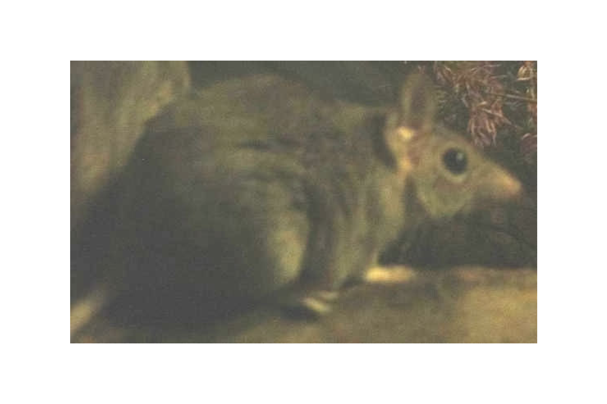

```{css, echo=FALSE}
h1, h2, h3 {
  text-align: center;
}
```

## **Fawn antechinus**
### *Antechinus bellus*
### Blamed on cats

:::: {style="display: flex;"}

[](https://www.inaturalist.org/photos/1562487?size=original)

::: {}

:::

::: {}
  ```{r map, echo=FALSE, fig.cap="", out.width = '100%'}
  knitr::include_graphics("assets/figures/Map_Cat_Antechinus bellus.png")
  ```
:::

::::
<center>
IUCN status: **Vulnerable**

EPBC Predator Threat Rating: **High**

IUCN claim: *"This species is likely to be disadvantaged by the current regime of frequent and extensive fire (Corbett et al. 2003, Woinarski et al. 2010), predation by feral cats (Woinarski et al. 2011) and some loss of its extensive habitat."*

</center>

### Studies in support

A single antechinus was among small mammals negatively correlated with cat occupancy (Stobo-Wilson et al. 2020).

### Studies not in support

No studies

### Is the threat claim evidence-based?

No studies were found evidencing a negative association between cats and antechinus population trends. A single animal is not population data.
<br>
<br>

![**Evidence linking *Antechinus bellus* to cats.** Systematic review of evidence for an association between *Antechinus bellus* and cats. Positive studies are in support of the hypothesis that *cats* contribute to the decline of Antechinus bellus, negative studies are not in support. Predation studies include studies documenting hunting or scavenging; baiting studies are associations between poison baiting and threatened mammal abundance where information on predator abundance is not provided; population studies are associations between threatened mammal and predator abundance. See methods section in [current submission] for details on evidence categories.](assets/figures/Main_Evidence_Cat_Antechinus bellus.png)

### References

Current submission (2023) Scant evidence that introduced predators cause extinctions.

EPBC. (2015) Threat Abatement Plan for Predation by Feral Cats. Environment Protection and Biodiversity Conservation Act 1999, Department of Environment, Government of Australia. (Table A1).

IUCN Red List. https://www.iucnredlist.org/ Accessed June 2023

Stobo-Wilson, A.M., Stokeld, D., Einoder, L.D., Davies, H.F., Fisher, A., Hill, B.M., Mahney, T., Murphy, B.P., Scroggie, M.P., Stevens, A. and Woinarski, J.C.Z., 2020. Bottom-up and top-down processes influence contemporary patterns of mammal species richness in Australia's monsoonal tropics. Biological Conservation, 247, p.108638.

