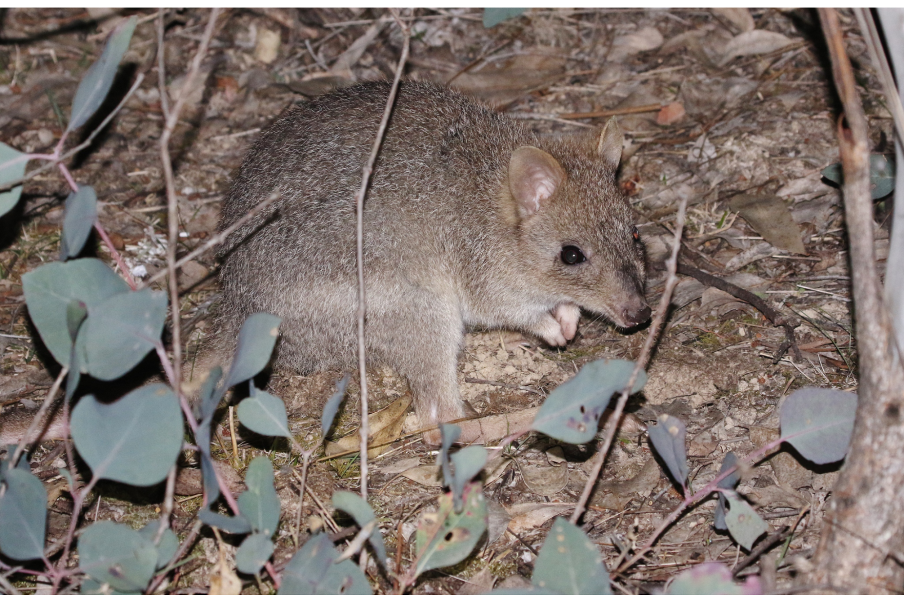

```{css, echo=FALSE}
h1, h2, h3 {
  text-align: center;
}
```

## **Eastern bettong**
### *Bettongia gaimardi*
### Blamed on cats

:::: {style="display: flex;"}

[](https://www.inaturalist.org/photos/27396353?size=original)

::: {}

:::

::: {}
  ```{r map, echo=FALSE, fig.cap="", out.width = '100%'}
  
  ```
:::

::::
<center>
IUCN status: **Near Threatened**

EPBC Threat Rating: **High**

IUCN claim: *"The Eastern Bettong is potentially threatened by predation from the Red Fox (Vulpes vulpes) and feral Cat (Felis catus). Historically, the Red Fox has not occurred in Tasmania, but if it were to become established in Tasmania this could be expected to have a major impact on the Eastern Bettong, given the evidence that predation by the Red Fox caused the species' extinction from mainland Australia (Short 1998; Johnson 2006). There is evidence of a recent incursion of the Red Fox, possibly as a result of a deliberate introduction (Sarre et al. 2013)."*

</center>

### Studies in support

Bettongs declined on a Tasmanian cattle station after cats were detected (Fancourt 2014). Bettongs were last confirmed in NSW 59 years after cats arrived (Wallach et al. 202X)

### Studies not in support

Cats and bettongs have co-occurred in Tasmania since 1820 (Abbott 2008). Cats were not among predators of reintroduced bettongs (Evans et al. 2021).

### Is the threat claim evidence-based?

There are no studies evidencing a negative association between  cats and eastern bettong populations. A single observation is an anecdote. In contradiction with the claim, bettongs and cats co-occured for decades on the mainland, and continue to co-occur in Tasmania after more than two centuries.
<br>
<br>

![**Evidence linking *Bettongia gaimardi* to cats.** **A.** Systematic review of evidence for an association between *Bettongia gaimardi* and cats. Positive studies are in support of the hypothesis that cats contribute to the decline of *Bettongia gaimardi*, negative studies are not in support. Predation studies include studies documenting hunting or scavenging; baiting studies are associations between poison baiting and threatened mammal abundance where information on predator abundance is not provided; population studies are associations between threatened mammal and predator abundance. **B.** Last records of extirpated populations relative to earliest local records of cats. Error bars show record uncertainty range. Predator arrival records were digitized from Abbott 2008.](assets/figures/Main_Evidence_Cat_Bettongia gaimardi.png)

### References

Abbott, The spread of the cat, Felis catus, in Australia: re-examination of the current conceptual model with additional information. Conservation Science Western Australia 7 (2008).

EPBC. (2015) Threat Abatement Plan for Predation by Feral Cats. Environment Protection and Biodiversity Conservation Act 1999, Department of Environment, Government of Australia. (Table A1).

Evans, Maldwyn J., et al. "The ‘goldilocks zone’of predation: The level of fox control needed to select predator resistance in a reintroduced mammal in Australia." Biodiversity and Conservation 30.6 (2021): 1731-1752

Fancourt, B. A. (2014). Rapid decline in detections of the Tasmanian bettong (Bettongia gaimardi) following local incursion of feral cats (Felis catus). Australian Mammalogy, 36(2), 247. doi:10.1071/am14004 

Wallach et al. 2023 In Submission

