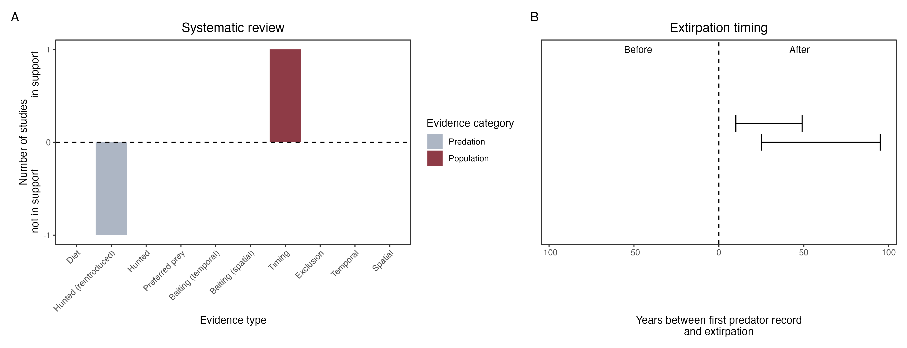

```{css, echo=FALSE}
h1, h2, h3 {
  text-align: center;
}
```

## **Eastern bettong**
### *Bettongia gaimardi*

:::: {style="display: flex;"}

::: {}
  ```{r icon, echo=FALSE, fig.cap="", out.width = '100%'}
  knitr::include_graphics("assets/phylopics/PLACEHOLDER_ready.png")
  ```
:::

::: {}

:::

::: {}
  ```{r map, echo=FALSE, fig.cap="", out.width = '100%'}
  knitr::include_graphics("assets/figures/Map_Cat_Bettongia gaimardi.png")
  ```
:::

::::
<center>
IUCN Status: **Near Threatened**

EPBC Threat Rating: **High**

IUCN Claim: *The Eastern Bettong is potentially threatened by predation from the Red Fox (Vulpes vulpes) and feral Cat (Felis catus). Historically, the Red Fox has not occurred in Tasmania, but if it were to become established in Tasmania this could be expected to have a major impact on the Eastern Bettong, given the evidence that predation by the Red Fox caused the species' extinction from mainland Australia (Short 1998; Johnson 2006). There is evidence of a recent incursion of the Red Fox, possibly as a result of a deliberate introduction (Sarre et al. 2013).'*

</center>

### Studies in support

Bettongs declined on a Tasmanian cattle station after cats were detected (Fancourt 2014). Bettongs were last confirmed in NSW 59 years after cats arrived (Wallach et al. 202X)

### Studies not in support

Cats and bettongs have co-occurred in Tasmania since 1820 (Abbott 2008). Cats were not among predators of reintroduced bettongs (Evans et al. 2021).

### Is the threat claim evidence-based?

There are no studies evidencing a negative association between  cats and eastern bettong populations. A single observation is an anecdote. In contradiction with the claim, bettongs and cats co-occured for decades on the mainland, and continue to co-occur in Tasmania after more than two centuries.
<br>
<br>



### References

Fancourt, B. A. (2014). Rapid decline in detections of the Tasmanian bettong (Bettongia gaimardi) following local incursion of feral cats (Felis catus). Australian Mammalogy, 36(2), 247. doi:10.1071/am14004 

Evans, Maldwyn J., et al. "The ‘goldilocks zone’of predation: The level of fox control needed to select predator resistance in a reintroduced mammal in Australia." Biodiversity and Conservation 30.6 (2021): 1731-1752

Wallach et al. 2023 In Submission

