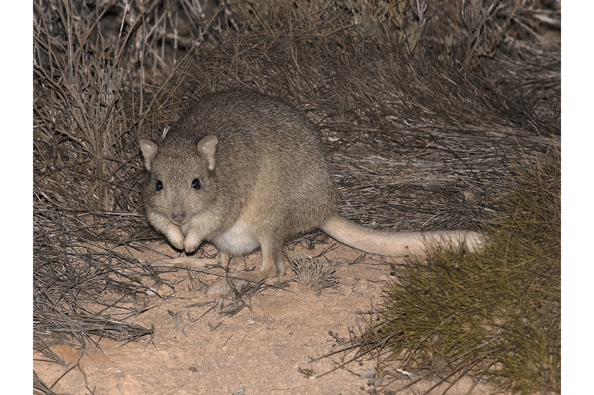

```{css, echo=FALSE}
h1, h2, h3 {
  text-align: center;
}
```

## **Burrowing bettong**
### *Bettongia lesueur*
### Blamed on cats

:::: {style="display: flex;"}

[](https://www.inaturalist.org/photos/96201616?size=original)

::: {}

:::

::: {}
  ```{r map, echo=FALSE, fig.cap="", out.width = '100%'}
  
  ```
:::

::::
<center>
IUCN status: **Near Threatened**

EPBC Threat Rating: **Moderate**

IUCN claim: *"The current major threats to the natural populations of the species include: the accidental introduction of predators (introduced cats and foxes)"*

</center>

### Studies in support

Cats were the main predator, or a predator, of predator-inexperienced (where known) reintroduced bettongs (Christensen & Burrows 1995; Short & Turner 2000; Moseby et al. 2011; Moseby et al. 2018; Moyses et al. 2020). Cats hunted bettongs in fenced reserve (Moseby et al. 2019). Bettongs were last confirmed in NSW, QLD and Victoria 17-40 years after cats arrived (Wallach et al. In Submission).

### Studies not in support

A positive correlation was found between cat and bettong abundance within a fenced reserve, despite evidence of hunting, and bettong recruitment was confirmed (Moseby et al. 2019). A cat breached the fence of a semi-captive bettong enclosure, yet none were hunted in 1 month (from Moseby et al. 2015). Bettongs were last confirmed in Western Australia a century after cats arrived (Wallach et al. In Submission).

### Is the threat claim evidence-based?

There are no studies evidencing a negative association between cats and burrowing bettong populations. The fate of reintroduced animals is not a proxy for the fate of locally-born populations. In contradiction with the claim, the two species co-occurred for decades and up to a century in some regions.
<br>
<br>

![**Evidence linking *Bettongia lesueur* to cats.** **A.** Systematic review of evidence for an association between *Bettongia lesueur* and cats. Positive studies are in support of the hypothesis that cats contribute to the decline of *Bettongia lesueur*, negative studies are not in support. Predation studies include studies documenting hunting or scavenging; baiting studies are associations between poison baiting and threatened mammal abundance where information on predator abundance is not provided; population studies are associations between threatened mammal and predator abundance. **B.** Last records of extirpated populations relative to earliest local records of cats. Error bars show record uncertainty range. Predator arrival records were digitized from Abbott 2008. Small points show unconfirmed records (excluded from analyses).](assets/figures/Main_Evidence_Cat_Bettongia lesueur.png)

### References

Abbott, The spread of the cat, Felis catus, in Australia: re-examination of the current conceptual model with additional information. Conservation Science Western Australia 7 (2008).

Christensen, P. and Burrows, N., 1995. Project desert dreaming: experimental reintroduction of mammals to the Gibson Desert, Western Australia. Reintroduction Biology of Australian and New Zealand Fauna’.(Ed. M. Serena.) pp, pp.199-207.

EPBC. (2015) Threat Abatement Plan for Predation by Feral Cats. Environment Protection and Biodiversity Conservation Act 1999, Department of Environment, Government of Australia. (Table A1).

Moseby K, Peacock D, Read J. 2015. Catastrophic cat predation: a call for predator profiling in wildlife protection programs. Biological Conservation 191:331-340.

Moseby, K.E., Letnic, M., Blumstein, D.T. and West, R., 2018. Designer prey: can controlled predation accelerate selection for anti-predator traits in naïve populations?. Biological Conservation, 217, pp.213-221.

Moseby, K.E., Letnic, M., Blumstein, D.T. and West, R., 2019. Understanding predator densities for successful co‐existence of alien predators and threatened prey. Austral Ecology, 44(3), pp.409-419.

Moseby, K.E., Read, J.L., Paton, D.C., Copley, P., Hill, B.M. and Crisp, H.A., 2011. Predation determines the outcome of 10 reintroduction attempts in arid South Australia. Biological Conservation, 144(12), pp.2863-2872.

Moyses, J., Hradsky, B., Tuft, K., Moseby, K., Golding, N. and Wintle, B., 2020. Factors influencing the residency of bettongs using one‐way gates to exit a fenced reserve. Austral Ecology, 45(7), pp.858-871.

Short, J. and Turner, B., 2000. Reintroduction of the burrowing bettong Bettongia lesueur (Marsupialia: Potoroidae) to mainland Australia. Biological Conservation, 96(2), pp.185-196.

Wallach et al. 2023 In Submission

