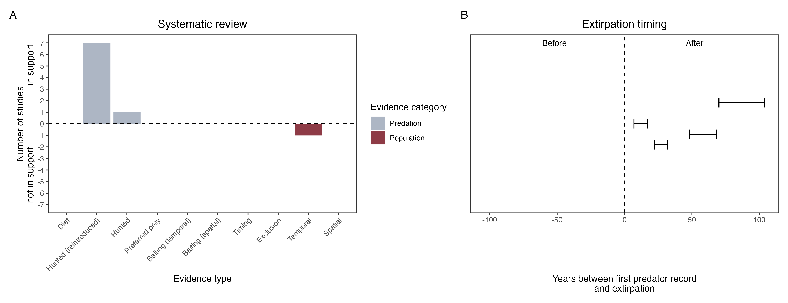

```{css, echo=FALSE}
h1, h2, h3 {
  text-align: center;
}
```

## **Woylie**
### *Bettongia penicillata*
### Blamed on cats

:::: {style="display: flex;"}

::: {}
  ```{r icon, echo=FALSE, fig.cap="", out.width = '100%'}
  knitr::include_graphics("assets/phylopics/PLACEHOLDER_ready.png")
  ```
:::

::: {}

:::

::: {}
  ```{r map, echo=FALSE, fig.cap="", out.width = '100%'}
  knitr::include_graphics("assets/figures/Map_Cat_Bettongia penicillata.png")
  ```
:::

::::
<center>
IUCN Status: **Critically Endangered**

EPBC Threat Rating: **High/Very High**

IUCN Claim: *'The major reason for past decline has been predation by Red Foxes and feral cats''*

</center>

### Studies in support

Cats commonly predate on reintroduced woylies (James et al. 2002; Priddel & Wheeler 2004; Martin et al. 2006; Wheeler & Priddel 2009; Marlow et al. 2015a). Woylies were last recorded in NSW 7-27 years after cats arrived and in the Nullarbor 53 years after cats arrived (Wallach et al. 202X).

### Studies not in support

No correlation was suggested nor tested between woylie and cat abundance (Wayne et al. 2017). Several woylie deaths were attributed to cat predation, but after killing a single cat (described “large”), predation ceased despite other cats remaining in the area (from Moseby et al. 2015).

### Is the threat claim evidence-based?

There are no studies evidencing a negative association between cats and woylie populations. The fate of reintroduced animals is not a reliable proxy for the fate of populations.
<br>
<br>



### References

Wayne, Adrian F., et al. "Recoveries and cascading declines of native mammals associated with control of an introduced predator." Journal of Mammalogy 98.2 (2017): 489-50

James, H., Acharya, A.B., Taylor, J.A. and Freak, M.J. (2002). A case of bitten bettongs. The Journal of Forensic Odonto-Stomatology 20(1): 10-12.

Marlow, Nicola J., et al. "Cats (Felis catus) are more abundant and are the dominant predator of woylies (Bettongia penicillata) after sustained fox (Vulpes vulpes) control." Australian Journal of Zoology 63.1 (2015b): 18-27.

Wheeler, R., & Priddel, D. (2009). The impact of introduced predators on two threatened prey species: A case study from western New South Wales. Ecological Management & Restoration, 10, S117–S123. doi:10.1111/j.1442-8903.2009.00457.x 

Martin, Sheridan, Stephen Ball, and Paula Peeters. "Reintroduction of the brush-tailed Bettong (Bettongia penicillata ogilbyi) into Lincoln National Park." (2006).

Priddel, D. and Wheeler, R. (2004). An experimental translocation of woylies (Bettongia penicillata) to western New South Wales. Wildlife Research 31: 421-432.

Moseby K, Peacock D, Read J. 2015. Catastrophic cat predation: a call for predator profiling in wildlife protection programs. Biological Conservation 191:331-340.

Wallach et al. 2023 In Submission

