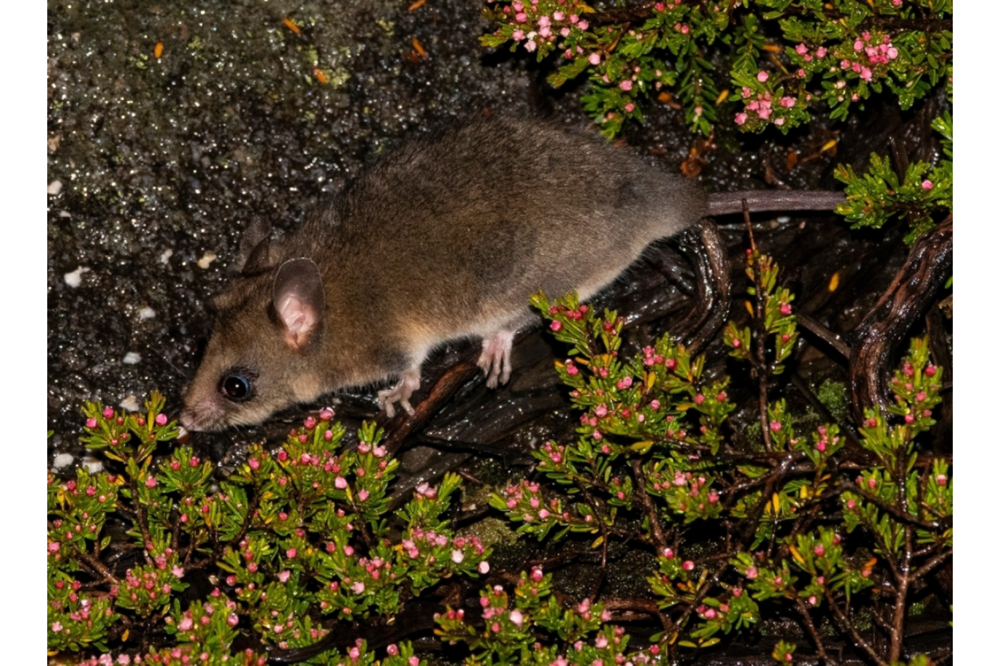

```{css, echo=FALSE}
h1, h2, h3 {
  text-align: center;
}
```

## **Mountain pygmy possum**
### *Burramys parvus*
### Blamed on cats

:::: {style="display: flex;"}

[](https://www.inaturalist.org/photos/109581343?size=original)

::: {}

:::

::: {}
  ```{r map, echo=FALSE, fig.cap="", out.width = '100%'}
  knitr::include_graphics("assets/figures/Map_Cat_Burramys parvus.png")
  ```
:::

::::
<center>
IUCN status: **Critically Endangered**

EPBC Predator Threat Rating: **Very high**

IUCN claim: *"The population at Mt. Buller suffers from fragmentation and subpopulations here and around ski resorts in the Kosciuszko area have declined severely since 2000 due to: habitat destruction, predation by feral cats, and possibly low snow cover. "*

</center>

### Studies in support

Possums were found in cat’s diet (Doherty et al. 2015).

### Studies not in support

No studies

### Is the threat claim evidence-based?

There are no studies linking cats to pygmy possum populations.
<br>
<br>

![**Evidence linking *Burramys parvus* to cats.** Systematic review of evidence for an association between *Burramys parvus* and cats. Positive studies are in support of the hypothesis that *cats* contribute to the decline of Burramys parvus, negative studies are not in support. Predation studies include studies documenting hunting or scavenging; baiting studies are associations between poison baiting and threatened mammal abundance where information on predator abundance is not provided; population studies are associations between threatened mammal and predator abundance.](assets/figures/Main_Evidence_Cat_Burramys parvus.png)

### References


Current submission (2023) Scant evidence that introduced predators cause extinctions. Conservation Biology

EPBC. (2015) Threat Abatement Plan for Predation by Feral Cats. Environment Protection and Biodiversity Conservation Act 1999, Department of Environment, Government of Australia. (Table A1).

IUCN Red List. https://www.iucnredlist.org/ Accessed June 2023

