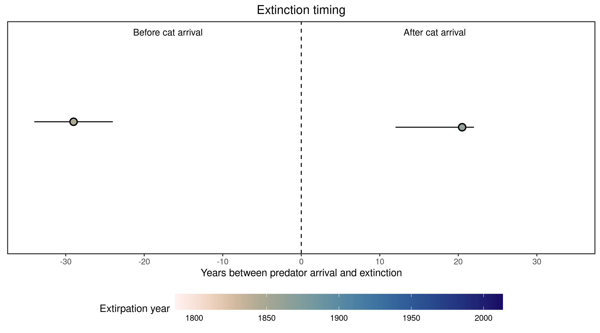

```{css, echo=FALSE}
h1, h2, h3 {
  text-align: center;
}
```

## **White-footed rabbit rat**
### *Conilurus albipes*

:::: {style="display: grid; grid-template-columns: 1fr 1fr; grid-column-gap: 10px;"}

::: {}

IUCN Status: **Extinct**

Last seen: *Conilurus albipes were last seen in 1862 in Victoria*
:::

::: {}
  ```{r icon, echo=FALSE, fig.cap="", out.width = '100%'}
  knitr::include_graphics("assets/phylopics/PLACEHOLDER_ready.png")
  ```
:::

::::

### Studies in support

White-footed rabbit rats were last confirmed in Victoria 20 years after cats arrived (Wallach et al. 202X).

### Studies not in support

White-footed rabbit rats were last confirmed in NSW 29 years before cats arrived (Wallach et al. 202X).

### Is the threat claim evidence-based?

There are no studies evidencing a link between cats and the extinction of white-footed rabbit rats. In contradiction with the claim, the extinction record from NSW pre-dates the cat arrival record.
<br>
<br>



### References

Wallach et al. 2023 In Submission

