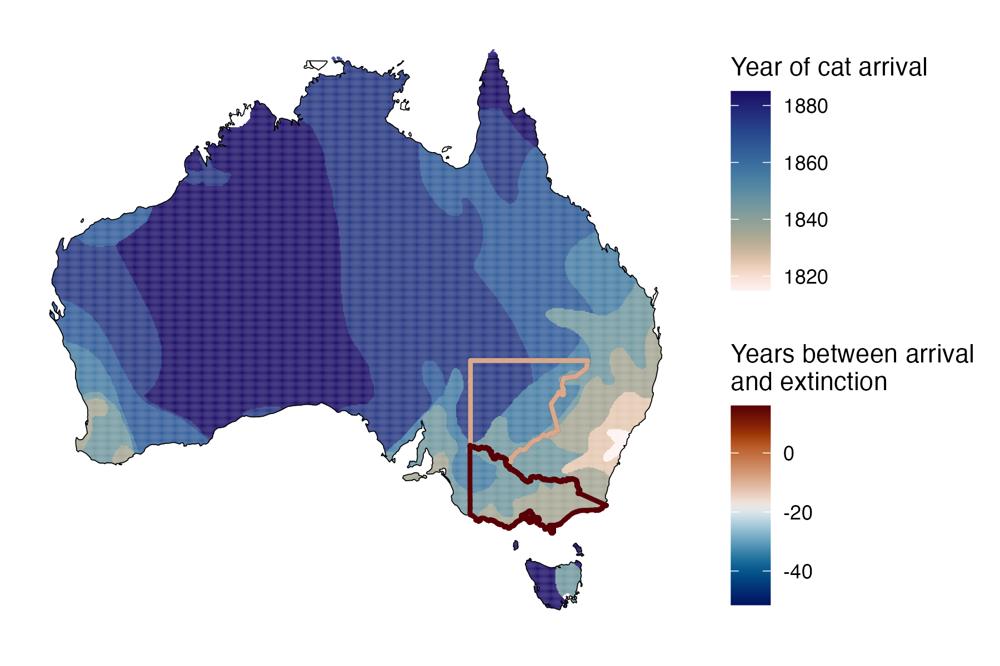

```{css, echo=FALSE}
h1, h2, h3 {
  text-align: center;
}
```

## **White-footed rabbit rat**
### *Conilurus albipes*
### Blamed on cats

:::: {style="display: flex;"}

::: {}
  ```{r icon, echo=FALSE, fig.cap="", out.width = '100%'}
  knitr::include_graphics("assets/phylopics/PLACEHOLDER_ready.png")
  ```
:::

::: {}

:::

::: {}
  ```{r map, echo=FALSE, fig.cap="", out.width = '100%'}
  
  ```
:::

::::

<center>
IUCN Status: **Extinct**

Last Seen: *Conilurus albipes were last seen in 1862 in Victoria*

</center>


### Studies in support

White-footed rabbit rats were last confirmed in Victoria 20 years after cats arrived (Wallach et al. 202X).

### Studies not in support

White-footed rabbit rats were last confirmed in NSW 29 years before cats arrived (Wallach et al. 202X).

### Is the threat claim evidence-based?

There are no studies evidencing a link between cats and the extinction of white-footed rabbit rats. In contradiction with the claim, the extinction record from NSW pre-dates the cat arrival record.
<br>
<br>


### References

Abbott, The spread of the cat, Felis catus, in Australia: re-examination of the current conceptual model with additional information. Conservation Science Western Australia 7 (2008).

Wallach et al. 2023 In Submission

