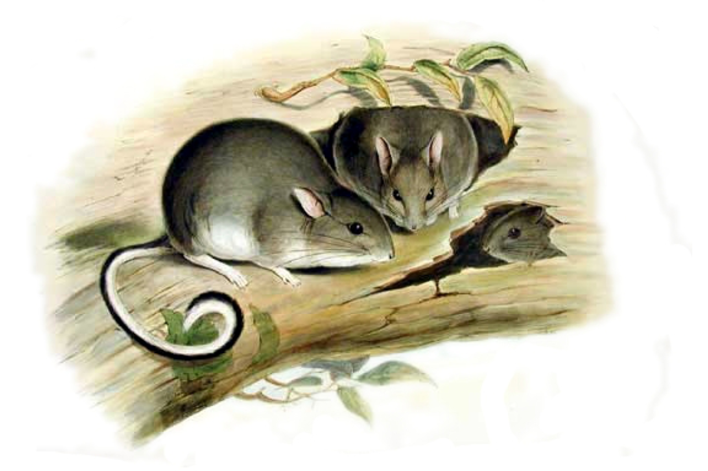
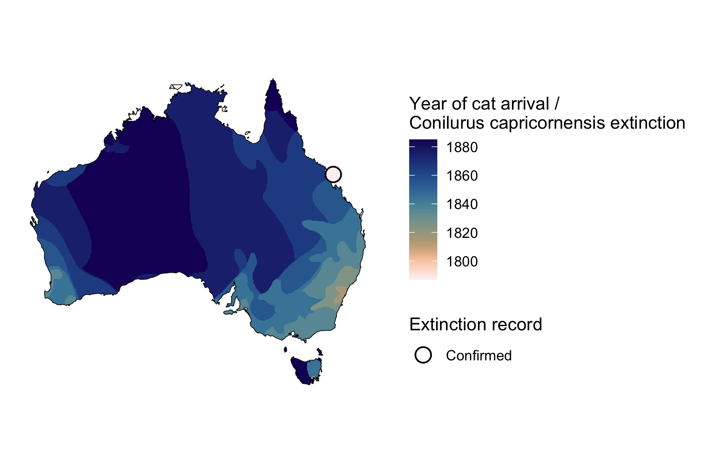
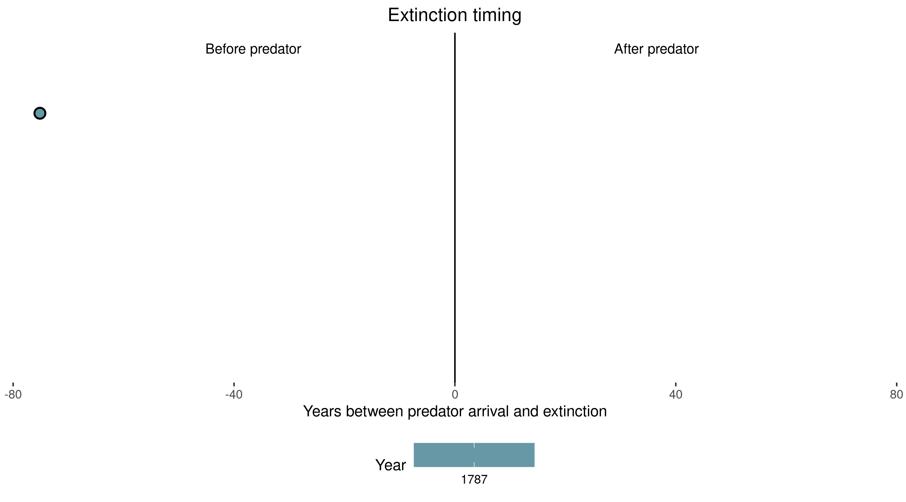

```{css, echo=FALSE}
h1, h2, h3 {
  text-align: center;
}
```

## **Capricorn rabbit rat**
### *Conilurus capricornensis*
### Blamed on cats

:::: {style="display: flex;"}

::: {}



:::

::: {}

:::

::: {}
  ```{r map, echo=FALSE, fig.cap="", out.width = '100%'}
  
  ```
:::

::::

<center>
IUCN status: **Extinct**

Last seen: *Conilurus capricornensis were last seen in 1787 in Rockhampton and Townsville regions, QLD (IUCN 2023)*

IUCN claim: *"This species has never been recorded alive, so assessment of threats is speculative. It was probably affected by the same threats that contributed to the extinction of Conilurus albipes - most likely predation by feral cats"*

</center>


### Studies in support

No studies

### Studies not in support

Capricorn rabbit rats were last confirmed 75 years before cats arrived (Current submission).

### Is the threat claim evidence-based?

There are no studies evidencing a link between cats and the extinction of Capricorn rabbit rats. In contradiction with the claim, the extinction record pre-dates the cat arrival record.
<br>
<br>



### References

Abbott, The spread of the cat, Felis catus, in Australia: re-examination of the current conceptual model with additional information. Conservation Science Western Australia 7 (2008).

Current submission (2023) Scant evidence that introduced predators cause extinctions.

IUCN Red List. https://www.iucnredlist.org/ Accessed June 2023

