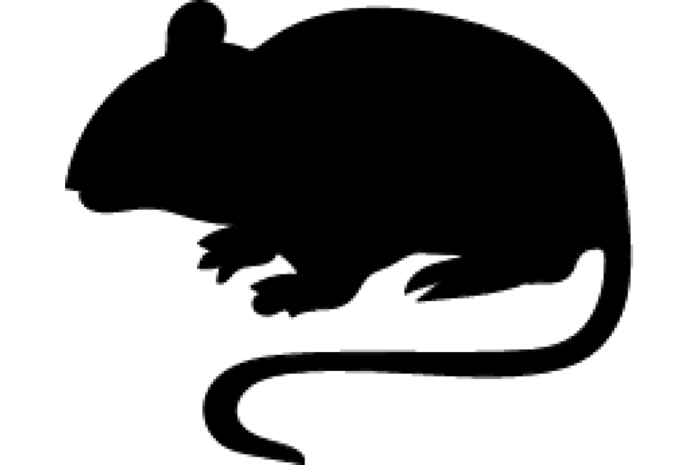

```{css, echo=FALSE}
h1, h2, h3 {
  text-align: center;
}
```

## **Capricorn rabbit rat**
### *Conilurus capricornensis*
### Blamed on cats

:::: {style="display: flex;"}

::: {}



:::

::: {}

:::

::: {}
  ```{r map, echo=FALSE, fig.cap="", out.width = '100%'}
  knitr::include_graphics("assets/figures/Map_Cat_Conilurus capricornensis.png")
  ```
:::

::::

<center>
IUCN status: **Extinct**

NA

IUCN claim: *"This species has never been recorded alive, so assessment of threats is speculative. It was probably affected by the same threats that contributed to the extinction of Conilurus albipes - most likely predation by feral cats"*

</center>


### Studies in support

No studies

### Studies not in support

No studies

### Is the threat claim evidence-based?

No studies were found linking cats to Capricorn rabbit rats.
<br>
<br>


### References


Abbott, The spread of the cat, Felis catus, in Australia: re-examination of the current conceptual model with additional information. Conservation Science Western Australia 7 (2008).

Current submission (2023) Scant evidence that introduced predators cause extinctions.

IUCN Red List. https://www.iucnredlist.org/ Accessed June 2023

