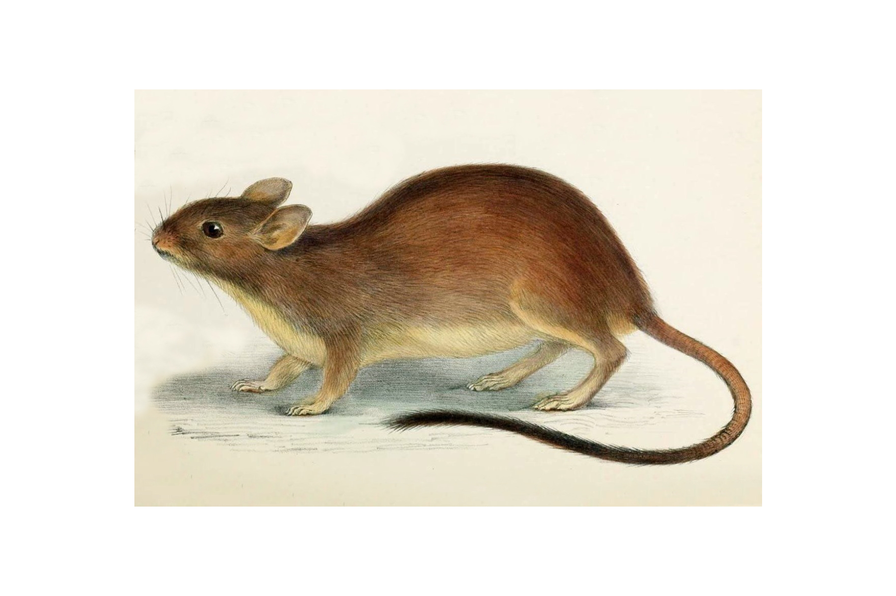

```{css, echo=FALSE}
h1, h2, h3 {
  text-align: center;
}
```

## **Brush-tailed rabbit rat**
### *Conilurus penicillatus*
### Blamed on cats

:::: {style="display: flex;"}

[](https://en.wikipedia.org/wiki/Brush-tailed_rabbit_rat#/media/File:Conilurus_penicillatus.jpg)

::: {}

:::

::: {}
  ```{r map, echo=FALSE, fig.cap="", out.width = '100%'}
  knitr::include_graphics("assets/figures/Map_Cat_Conilurus penicillatus.png")
  ```
:::

::::
<center>
IUCN status: **Vulnerable**

EPBC Predator Threat Rating: **High/Very High**

IUCN claim: *"Predation by feral cats is a likely major threat"*

</center>

### Studies in support

Lower rat site occupancy was associated with higher cat detection on Melville Island (Davies et al. 2017; Davies et al. 2018; Penton et al. 2021) and higher cat occupancy across Melville Island and north of Northern Territory mainland (Stobo-Wilson et al. 2020a)

### Studies not in support

No studies

### Is the threat claim evidence-based?

Cats are among a range of ecological variables negatively correlated with rat abundance, but causality cannot be inferred due to confounding variables.
<br>
<br>

![**Evidence linking *Conilurus penicillatus* to cats.** Systematic review of evidence for an association between *Conilurus penicillatus* and cats. Positive studies are in support of the hypothesis that *cats* contribute to the decline of Conilurus penicillatus, negative studies are not in support. Predation studies include studies documenting hunting or scavenging; baiting studies are associations between poison baiting and threatened mammal abundance where information on predator abundance is not provided; population studies are associations between threatened mammal and predator abundance.](assets/figures/Main_Evidence_Cat_Conilurus penicillatus.png)

### References

Current submission (2023) Scant evidence that introduced predators cause extinctions. Conservation Biology

Davies, H.F., McCarthy, M.A., Firth, R.S., Woinarski, J.C., Gillespie, G.R., Andersen, A.N., Geyle, H.M., Nicholson, E. and Murphy, B.P., 2017. Top‐down control of species distributions: feral cats driving the regional extinction of a threatened rodent in northern Australia. Diversity and Distributions, 23(3), pp.272-283.

Davies, H.F., McCarthy, M.A., Firth, R.S., Woinarski, J.C., Gillespie, G.R., Andersen, A.N., Rioli, W., Puruntatameri, J., Roberts, W., Kerinaiua, C. and Kerinauia, V., 2018. Declining populations in one of the last refuges for threatened mammal species in northern Australia. Austral Ecology, 43(5), pp.602-612.

EPBC. (2015) Threat Abatement Plan for Predation by Feral Cats. Environment Protection and Biodiversity Conservation Act 1999, Department of Environment, Government of Australia. (Table A1).

IUCN Red List. https://www.iucnredlist.org/ Accessed June 2023

Penton, C.E., Davies, H.F., Radford, I.J., Woolley, L.A., Rangers, T.L. and Murphy, B.P., 2021. A hollow argument: understory vegetation and disturbance determine abundance of hollow-dependent mammals in an Australian tropical savanna. Frontiers in Ecology and Evolution, 9, p.739550.

Stobo-Wilson, A.M., Stokeld, D., Einoder, L.D., Davies, H.F., Fisher, A., Hill, B.M., Mahney, T., Murphy, B.P., Scroggie, M.P., Stevens, A. and Woinarski, J.C.Z., 2020. Bottom-up and top-down processes influence contemporary patterns of mammal species richness in Australia's monsoonal tropics. Biological Conservation, 247, p.108638.

