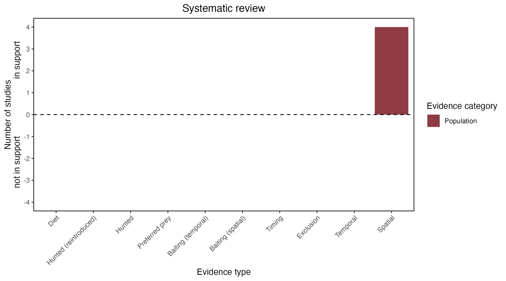

```{css, echo=FALSE}
h1, h2, h3 {
  text-align: center;
}
```

## **Brush-tailed rabbit rat**
### *Conilurus penicillatus*
### Blamed on cats

:::: {style="display: flex;"}

::: {}
  ```{r icon, echo=FALSE, fig.cap="", out.width = '100%'}
  knitr::include_graphics("assets/phylopics/PLACEHOLDER_ready.png")
  ```
:::

::: {}

:::

::: {}
  ```{r map, echo=FALSE, fig.cap="", out.width = '100%'}
  knitr::include_graphics("assets/figures/Map_Cat_Conilurus penicillatus.png")
  ```
:::

::::
<center>
IUCN Status: **Vulnerable**

EPBC Threat Rating: **High/Very High**

IUCN Claim: *'Predation by feral cats is a likely major threat''*

</center>

### Studies in support

Lower rat site occupancy was associated with higher cat detection on Melville Island (Davies et al. 2017; Davies et al. 2018; Penton et al. 2021) and higher cat occupancy across Melville Island and north of Northern Territory mainland (Stobo-Wilson et al. 2020a)

### Studies not in support

No studies

### Is the threat claim evidence-based?

Cats are among a range of ecological variables negatively correlated with rat abundance, but causality cannot be inferred due to confounding variables.
<br>
<br>



### References

Stobo-Wilson, A. M., et al. "Bottom-up and top-down processes influence contemporary patterns of mammal species richness in Australia's monsoonal tropics." Biological Conservation 247 (2020): 108638.

Davies, H. F., McCarthy, M. A., Firth, R. S., Woinarski, J. C., Gillespie, G. R., Andersen, A. N., ... & Murphy, B. P. (2018). Declining populations in one of the last refuges for threatened mammal species in northern Australia. Austral Ecology, 43(5), 602-612.

Penton, Cara E., et al. "A Hollow Argument: Understory Vegetation and Disturbance Determine Abundance of Hollow-Dependent Mammals in an Australian Tropical Savanna." Frontiers in Ecology and Evolution 9 (2021): 739550

Davies, H. F., McCarthy, M. A., Firth, R. S., Woinarski, J. C., Gillespie, G. R., Andersen, A. N., ... & Murphy, B. P. (2017). Top‐down control of species distributions: feral cats driving the regional extinction of a threatened rodent in northern Australia. Diversity and Distributions, 23(3), 272-283.

Wallach et al. 2023 In Submission

