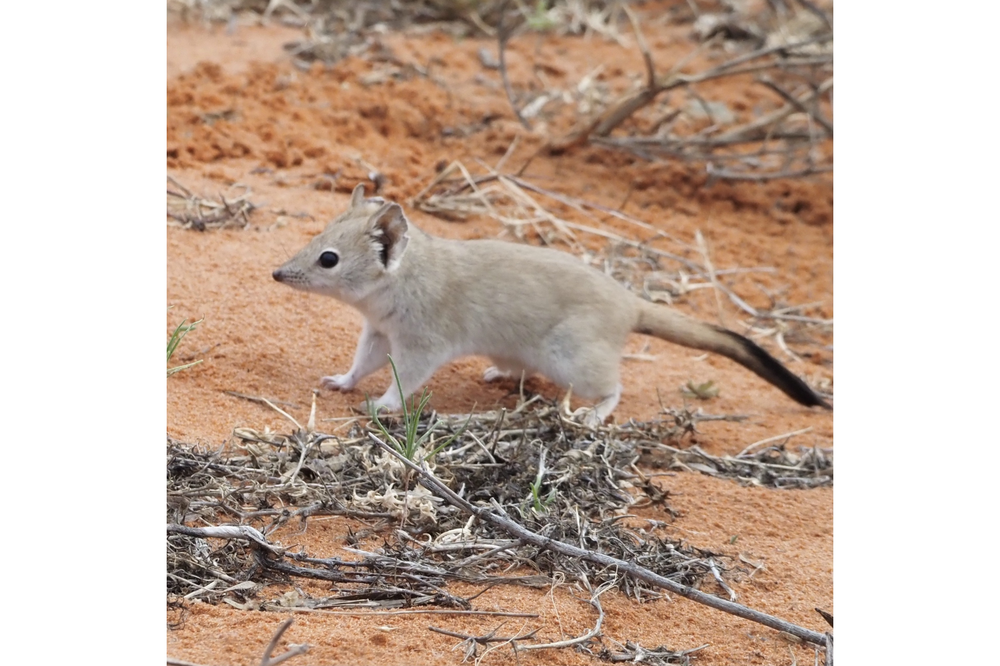
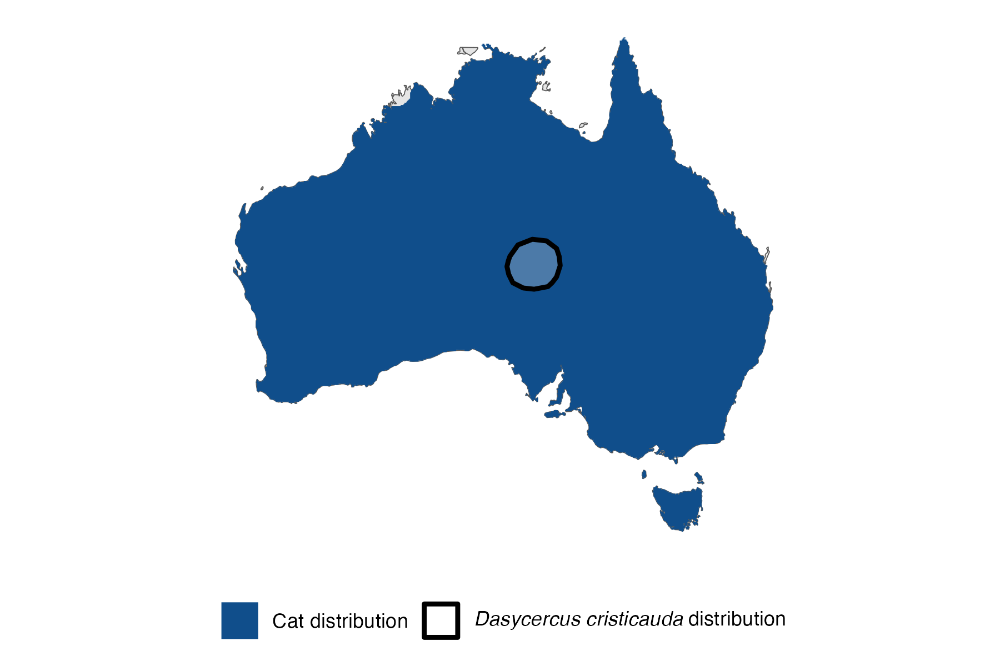

```{css, echo=FALSE}
h1, h2, h3 {
  text-align: center;
}
```

## **Crest-tailed mulgara**
### *Dasycercus cristicauda*
### Blamed on cats

:::: {style="display: flex;"}

[](https://www.inaturalist.org/photos/138476030?size=original)

::: {}

:::

::: {}
  ```{r map, echo=FALSE, fig.cap="", out.width = '100%'}
  
  ```
:::

::::
<center>
IUCN status: **Vulnerable**

EPBC Predator Threat Rating: **High**

IUCN claim: *"Threats are poorly understood but include predation by and competition with feral cats and Red Foxes,"*

</center>

### Studies in support

Pedler et al. (2016) documented cat decline and mulgara increase in occurance and occupancy when rabbits declined. Mulgara were found in cat’s diet (Mahon 1999; Paltridge 2002; Paltridge 2005; Vernes et al. 2021). Mulgara were last confirmed in the Western Division of NSW and the Nullarbor 19-69 and 38-58 after cats arrived, respectively  (Current submission).

### Studies not in support

No studies

### Is the threat claim evidence-based?

Negative correlation between cats and mulgara abundance was documented in one study. Causality for decline is uncertain due to confounding variables (e.g. rabbits).
<br>
<br>

![**Evidence linking *Dasycercus cristicauda* to cats.** **A.** Systematic review of evidence for an association between *Dasycercus cristicauda* and cats. Positive studies are in support of the hypothesis that cats contribute to the decline of *Dasycercus cristicauda*, negative studies are not in support. Predation studies include studies documenting hunting or scavenging; baiting studies are associations between poison baiting and threatened mammal abundance where information on predator abundance is not provided; population studies are associations between threatened mammal and predator abundance. **B.** Last records of extirpated populations relative to earliest local records of cats. Error bars show minimum and maximum extinction intervals. Predator arrival records were digitized from Abbott 2008. See methods section in [current submission] for details on evidence categories.](assets/figures/Main_Evidence_Cat_Dasycercus cristicauda.png)

### References

Abbott, The spread of the cat, Felis catus, in Australia: re-examination of the current conceptual model with additional information. Conservation Science Western Australia 7 (2008).

Current submission (2023) Scant evidence that introduced predators cause extinctions.

Dickman, C.R., Haythornthwaite, A.S., McNaught, G.H., Mahon, P.S., Tamayo, B. and Letnic, M., 2001. Population dynamics of three species of dasyurid marsupials in arid central Australia: a 10-year study. Wildlife Research, 28(5), pp.493-506.

EPBC. (2015) Threat Abatement Plan for Predation by Feral Cats. Environment Protection and Biodiversity Conservation Act 1999, Department of Environment, Government of Australia. (Table A1).

IUCN Red List. https://www.iucnredlist.org/ Accessed June 2023

Mahon, P.S., 1999. Predation by feral cats and red foxes and the dynamics of small mammal populations in arid Australia. PhD thesis, University of Sydney, Sydney, Australia.

Paltridge, R., 2002. The diets of cats, foxes and dingoes in relation to prey availability in the Tanami Desert, Northern Territory. Wildlife Research, 29(4), pp.389-403.

Paltridge, R.M., 2005. Predator-prey interactions in the spinifex grasslands of central Australia. PhD Thesis, University of Wollongong

Pedler, R.D., Brandle, R., Read, J.L., Southgate, R., Bird, P. and Moseby, K.E., 2016. Rabbit biocontrol and landscape‐scale recovery of threatened desert mammals. Conservation Biology, 30(4), pp.774-782.

Vernes, K., Jackson, S.M., Elliott, T.F., Tischler, M. and Harper, A., 2021. Diets of mammalian carnivores in the deserts of north-eastern South Australia. Journal of Arid Environments, 188, p.104377.

