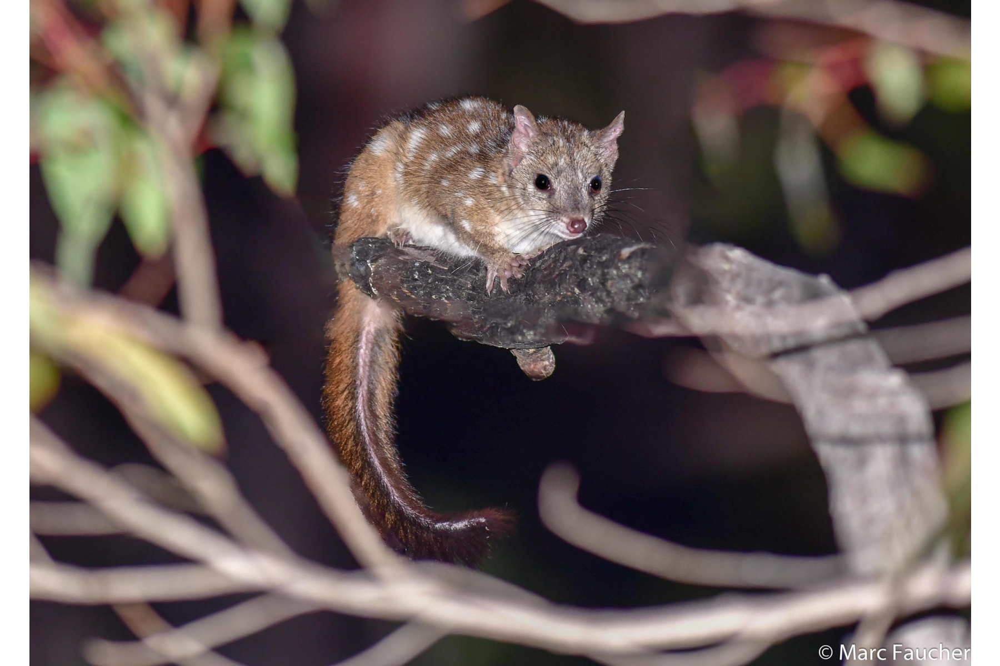

```{css, echo=FALSE}
h1, h2, h3 {
  text-align: center;
}
```

## **Western quoll**
### *Dasyurus geoffroii*
### Blamed on cats

:::: {style="display: flex;"}

[](https://www.inaturalist.org/photos/30906138?size=original)

::: {}

:::

::: {}
  ```{r map, echo=FALSE, fig.cap="", out.width = '100%'}
  
  ```
:::

::::
<center>
IUCN status: **Near Threatened**

EPBC Predator Threat Rating: **Moderate**

IUCN claim: *"Predation by introduced Red Fox and feral Cat are the major threats."*

</center>

### Studies in support

Cats hunted quolls translocated to the Flinders Ranges, SA (Moseby et al. 2015; Moseby et al. 2021a; Moseby et al. 2021b). Cats also hunt locally-born quolls (Glen et al. 2010). Detection rate of quolls was higher after poison-baiting targeting cats, in four monitoring periods, but measures of cat abundance differed by method and association between cat and quoll abundance was unclear (Comer et al. 2020). Quoll abundance increased while cat abundance declined, but no statistical analysis, control, or other variables were tested for (Wayne et al. 2017). Quolls were last confirmed 53 and 65 years after cats arrived in the Nullarbor and Eyre Peninsula, respectively (Current submission).

### Studies not in support

Intensive poison-baiting was associated with reduced cat abundance and reduced quoll abundance over time (Moseby et al. 2021a).

### Is the threat claim evidence-based?

There are no studies evidencing a negative association between cats and western quoll populations that has been tested statistically. Poison-baiting is not a reliable proxy of cat abundance.
<br>
<br>

![**Evidence linking *Dasyurus geoffroii* to cats.** **A.** Systematic review of evidence for an association between *Dasyurus geoffroii* and cats. Positive studies are in support of the hypothesis that cats contribute to the decline of *Dasyurus geoffroii*, negative studies are not in support. Predation studies include studies documenting hunting or scavenging; baiting studies are associations between poison baiting and threatened mammal abundance where information on predator abundance is not provided; population studies are associations between threatened mammal and predator abundance. **B.** Last records of extirpated populations relative to earliest local records of cats. Error bars show record uncertainty range. Predator arrival records were digitized from Abbott 2008.](assets/figures/Main_Evidence_Cat_Dasyurus geoffroii.png)

### References

Abbott, The spread of the cat, Felis catus, in Australia: re-examination of the current conceptual model with additional information. Conservation Science Western Australia 7 (2008).

Comer, S., Clausen, L., Cowen, S., Pinder, J., Thomas, A., Burbidge, A.H., Tiller, C., Algar, D. and Speldewinde, P., 2020. Integrating feral cat (Felis catus) control into landscape-scale introduced predator management to improve conservation prospects for threatened fauna: a case study from the south coast of Western Australia. Wildlife Research, 47(8), pp.762-778.

Current submission (2023) Scant evidence that introduced predators cause extinctions. Conservation Biology

EPBC. (2015) Threat Abatement Plan for Predation by Feral Cats. Environment Protection and Biodiversity Conservation Act 1999, Department of Environment, Government of Australia. (Table A1).

Glen, A.S., Berry, O., Sutherland, D.R., Garretson, S., Robinson, T. and De Tores, P.J., 2010. Forensic DNA confirms intraguild killing of a chuditch (Dasyurus geoffroii) by a feral cat (Felis catus). Conservation Genetics, 11, pp.1099-1101.

IUCN Red List. https://www.iucnredlist.org/ Accessed June 2023

Moseby, K., Hodgens, P., Bannister, H., Mooney, P., Brandle, R., Lynch, C., Young, C., Jansen, J. and Jensen, M., 2021. The ecological costs and benefits of a feral cat poison‐baiting programme for protection of reintroduced populations of the western quoll and brushtail possum. Austral Ecology, 46(8), pp.1366-1382.

Moseby, K.E., Hodgens, P., Peacock, D., Mooney, P., Brandle, R., Lynch, C., West, R., Young, C.M., Bannister, H., Copley, P. and Jensen, M.A., 2021. Intensive monitoring, the key to identifying cat predation as a major threat to native carnivore (Dasyurus geoffroii) reintroduction. Biodiversity and Conservation, 30, pp.1547-1571.

Moseby, K.E., Peacock, D.E. and Read, J.L., 2015. Catastrophic cat predation: a call for predator profiling in wildlife protection programs. Biological Conservation, 191, pp.331-340.

Wayne, A.F., Maxwell, M.A., Ward, C.G., Wayne, J.C., Vellios, C.V. and Wilson, I.J., 2017. Recoveries and cascading declines of native mammals associated with control of an introduced predator. Journal of Mammalogy, 98(2), pp.489-501.

