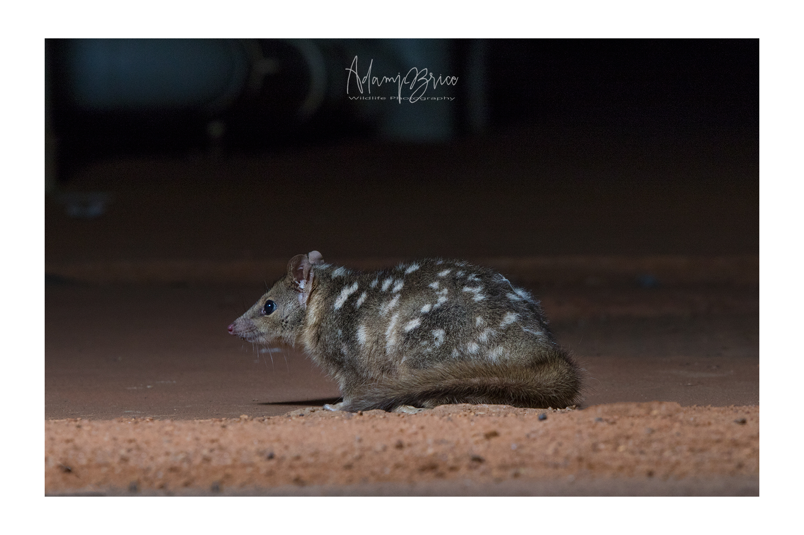
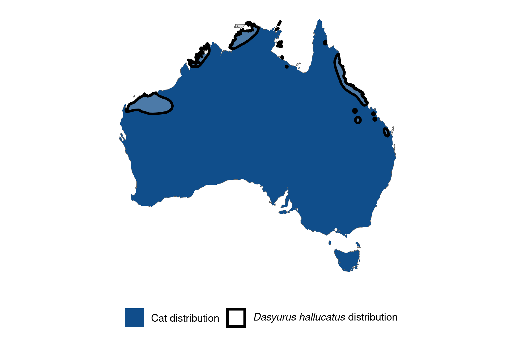

```{css, echo=FALSE}
h1, h2, h3 {
  text-align: center;
}
```

## **Northern quoll**
### *Dasyurus hallucatus*
### Blamed on cats

:::: {style="display: flex;"}

[](https://www.inaturalist.org/photos/20298309?size=original)

::: {}

:::

::: {}
  ```{r map, echo=FALSE, fig.cap="", out.width = '100%'}
  
  ```
:::

::::
<center>
IUCN status: **Endangered**

EPBC Predator Threat Rating: **High**

IUCN claim: *"Predation by feral cats may also be a threat."*

</center>

### Studies in support

Stobo-Wilson et al. (2020) reported lower quoll occupancy correlated with higher cat occupancy across Melville Island and north of Northern Territory mainland. Palmer et al. (2021) reported a positive association between poison-baiting targeting cats and quoll abundance, but no effect of poison-baiting on cats was found, nor direct association between cats and quolls tested. Cats hunt quolls (Pollock 1999; Oakwood 2000; Peacock & Abbott 2014; Stokeld et al. 2018; Cowan et al. 2020).

### Studies not in support

Palmer et al. (2021) reported a positive temporal correlation between northern quoll detections and poison baiting, but no correlation with cats. Analysing relationships between cats, quolls and vegetation in the tropical savanna, Trewella et al. (2023) concluded that the two species can co-occurr in structurally complex habitat. Woinarski et al. (2011) documented the presence and absence of quolls and cats across the Sir Edward Pellew island group: the quolls were present on one of the islands on which cats occurred.

### Is the threat claim evidence-based?

Some studies suggest that cats are among a range of ecological variables negatively correlated with quoll abundance, while other studies suggest that the two species can co-occur.
<br>
<br>

![**Evidence linking *Dasyurus hallucatus* to cats.** Systematic review of evidence for an association between *Dasyurus hallucatus* and cats. Positive studies are in support of the hypothesis that *cats* contribute to the decline of Dasyurus hallucatus, negative studies are not in support. Predation studies include studies documenting hunting or scavenging; baiting studies are associations between poison baiting and threatened mammal abundance where information on predator abundance is not provided; population studies are associations between threatened mammal and predator abundance. See methods section in [current submission] for details on evidence categories.](assets/figures/Main_Evidence_Cat_Dasyurus hallucatus.png)

### References

Cowan, M., Moro, D., Anderson, H., Angus, J., Garretson, S. and Morris, K., 2020. Aerial baiting for feral cats is unlikely to affect survivorship of northern quolls in the Pilbara region of Western Australia. Wildlife Research, 47(8), pp.589-598.

Current submission (2023) Scant evidence that introduced predators cause extinctions.

EPBC. (2015) Threat Abatement Plan for Predation by Feral Cats. Environment Protection and Biodiversity Conservation Act 1999, Department of Environment, Government of Australia. (Table A1).

IUCN Red List. https://www.iucnredlist.org/ Accessed June 2023

Oakwood, M., 2000. Reproduction and demography of the northern quoll, Dasyurus hallucatus, in the lowland savanna of northern Australia. Australian Journal of Zoology, 48(5), pp.519-539.

Palmer, R., Anderson, H., Richards, B., Craig, M.D. and Gibson, L., 2021. Does aerial baiting for controlling feral cats in a heterogeneous landscape confer benefits to a threatened native meso-predator?. PLoS One, 16(5), p.e0251304.

Peacock D, Abbott I. 2014. When the ‘native cat’would ‘plague’: historical hyperabundance in the quoll (Marsupialia: Dasyuridae) and an assessment of the role of disease, cats and foxes in its curtailment. Australian Journal of Zoology 62:294-344.

Pollock, A.B., 1999. Notes on status, distribution and diet of northern quoll Dasyurus hallucatus in the Mackay-Bowen area, mideastern Queensland. Australian Zoologist, 31(2), pp.388-395.

Stobo-Wilson, A.M., Stokeld, D., Einoder, L.D., Davies, H.F., Fisher, A., Hill, B.M., Mahney, T., Murphy, B.P., Scroggie, M.P., Stevens, A. and Woinarski, J.C.Z., 2020. Bottom-up and top-down processes influence contemporary patterns of mammal species richness in Australia's monsoonal tropics. Biological Conservation, 247, p.108638.

Stokeld D, Fisher A, Gentles T, Hill B, Triggs B, Woinarski JCZ, Gillespie GR. 2018. What do predator diets tell us about mammal declines in Kakadu National Park? Wildlife Research 45:92-101.

Trewella, G.J., Cremona, T., Nevard, H. and Murphy, B.P., 2023. Habitat structure facilitates coexistence of native and invasive mesopredators in an Australian tropical savanna. Wildlife Research, 50(12), pp.1058-1070.

Woinarski, J.C.Z., Ward, S., Mahney, T., Bradley, J., Brennan, K., Ziembicki, M. and Fisher, A., 2011. The mammal fauna of the Sir Edward Pellew island group, Northern Territory, Australia: refuge and death-trap. Wildlife Research, 38(4), pp.307-322.

