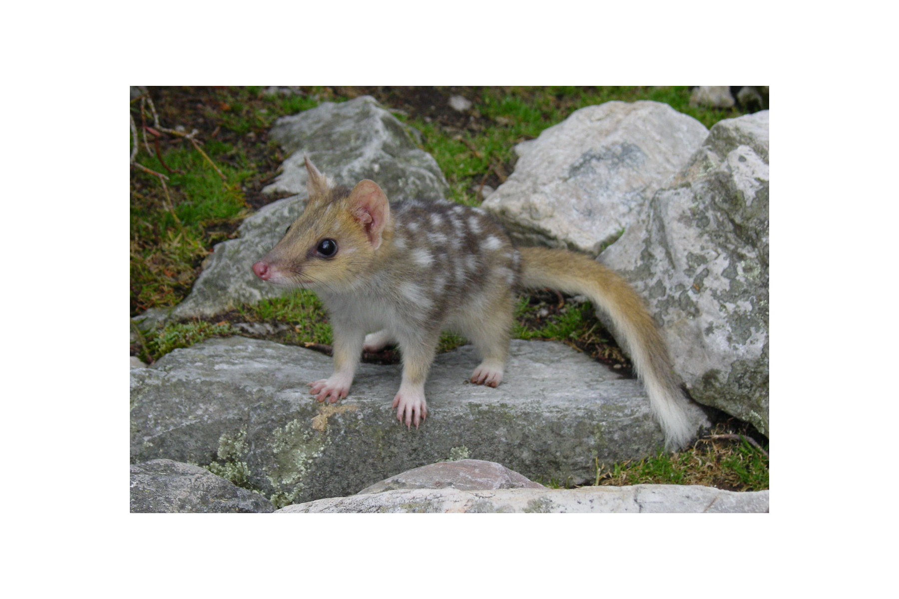

```{css, echo=FALSE}
h1, h2, h3 {
  text-align: center;
}
```

## **Eastern quoll**
### *Dasyurus viverrinus*
### Blamed on cats

:::: {style="display: flex;"}

[](https://www.inaturalist.org/photos/114390835?size=original)

::: {}

:::

::: {}
  ```{r map, echo=FALSE, fig.cap="", out.width = '100%'}
  
  ```
:::

::::
<center>
IUCN status: **Endangered**

EPBC Predator Threat Rating: **High**

IUCN claim: *"Predation by introduced feral cats and red foxes are the most likely causes."*

</center>

### Studies in support

There is evidence of cat predation of eatern quolls (Peacock & Abbott 2014)

### Studies not in support

Fancourt et al. (2015) found no evidence of a negative correlation between quoll and cat abundance. Cats were not among predators of reintroduced quolls (Peacock & Abbott 2014; Robinson et al. 2020; Robinson et al. 2021). Quolls were last confirmed in NSW 148 years after cats arrived and continue to co-occurr on Tasmania after two centuries (Current submission).

### Is the threat claim evidence-based?

There are no studies linking cats to tiger quoll populations. In contradiction with the claim, the two species co-occurred on the mainland for over a century and continue to co-occur in Tasmania after more than two centuries.
<br>
<br>

![**Evidence linking *Dasyurus viverrinus* to cats.** **A.** Systematic review of evidence for an association between *Dasyurus viverrinus* and cats. Positive studies are in support of the hypothesis that cats contribute to the decline of *Dasyurus viverrinus*, negative studies are not in support. Predation studies include studies documenting hunting or scavenging; baiting studies are associations between poison baiting and threatened mammal abundance where information on predator abundance is not provided; population studies are associations between threatened mammal and predator abundance. **B.** Last records of extirpated populations relative to earliest local records of cats. Error bars show record uncertainty range. Predator arrival records were digitized from Abbott 2008. Small points show unconfirmed records (excluded from analyses). See methods section in [current submission] for details on evidence categories.](assets/figures/Main_Evidence_Cat_Dasyurus viverrinus.png)

### References

Abbott, The spread of the cat, Felis catus, in Australia: re-examination of the current conceptual model with additional information. Conservation Science Western Australia 7 (2008).

Current submission (2023) Scant evidence that introduced predators cause extinctions.

EPBC. (2015) Threat Abatement Plan for Predation by Feral Cats. Environment Protection and Biodiversity Conservation Act 1999, Department of Environment, Government of Australia. (Table A1).

Fancourt, B.A., Hawkins, C.E., Cameron, E.Z., Jones, M.E. and Nicol, S.C., 2015. Devil declines and catastrophic cascades: is mesopredator release of feral cats inhibiting recovery of the eastern quoll?. PLoS One, 10(3), p.e0119303.

IUCN Red List. https://www.iucnredlist.org/ Accessed June 2023

Peacock D, Abbott I. 2014. When the ‘native cat’would ‘plague’: historical hyperabundance in the quoll (Marsupialia: Dasyuridae) and an assessment of the role of disease, cats and foxes in its curtailment. Australian Journal of Zoology 62:294-344.

Robinson NM, Blanchard W, MacGregor C, Brewster R, Dexter N, Lindenmayer DB. 2021. Can evolutionary theories of dispersal and senescence predict postrelease survival, dispersal, and body condition of a reintroduced threatened mammal? Ecol Evol;11:1002– 1012

Robinson, N.M., Dexter, N., Brewster, R., Maple, D., MacGregor, C., Rose, K., Hall, J. and Lindenmayer, D.B., 2020. Be nimble with threat mitigation: lessons learned from the reintroduction of an endangered species. Restoration Ecology, 28(1), pp.29-38.

