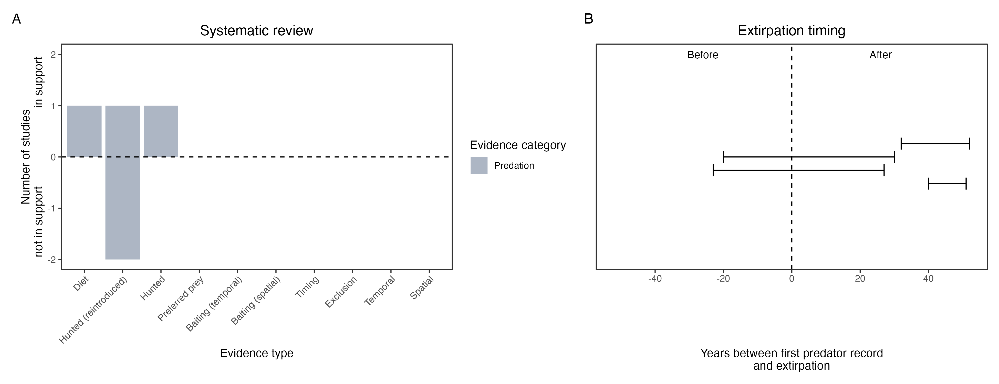

```{css, echo=FALSE}
h1, h2, h3 {
  text-align: center;
}
```

## **Golden bandicoot**
### *Isoodon auratus*
### Blamed on cats

:::: {style="display: flex;"}

::: {}
  ```{r icon, echo=FALSE, fig.cap="", out.width = '100%'}
  knitr::include_graphics("assets/phylopics/PLACEHOLDER_ready.png")
  ```
:::

::: {}

:::

::: {}
  ```{r map, echo=FALSE, fig.cap="", out.width = '100%'}
  
  ```
:::

::::
<center>
IUCN Status: **Vulnerable**

EPBC Threat Rating: **Moderate**

IUCN Claim: *'The reasons for past declines of the Golden Bandicoot are predation by feral cats and red foxes''*

</center>

### Studies in support

Cats were the main predator of a group of reintroduced, predator-inexperienced bandicoots (Blythman et al. 2020). Cats also predated on another reintroduced group (Christensen & Burrows 1995) and on locally-born bandicoots (Wysong 2016; Doherty et al. 2017). Bandicoots were last confirmed in the Nullarbor 37 years after cats arrived (Wallach et al. 202X).

### Studies not in support

Cat breached fence of semi-captive bandicoot enclosure, none were hunted in 5 weeks (from Moseby et al. 2015). Bandicoots were last confirmed in NSW 18 years before cats arrived (Wallach et al. 202X).

### Is the threat claim evidence-based?

There are no studies linking cats to golden bandicoot populations. The fate of reintroduced animals is not a reliable proxy for the fate of populations. In contradiction with the claim the extirpation record from NSW pre-dates the cat arrival record.
<br>
<br>



### References

Blythman, Mark, et al. "Translocation of golden bandicoots, Isoodon auratus barrowensis, from a fenced enclosure to unfenced managed land on Matuwa (formally Lorna Glen) in September 2015." (2020)

Doherty, T.S., Dickman, C.R., Johnson, C.N., Legge, S.M., Ritchie, E.G., and Woinarski, J.C.Z. (2017) Impacts and management of feral cats Felis catus in Australia. Mammal Review. 47 (2) 83-97; which has been published in final form at https://doi.org/10.1111/mam.12080

Wysong ML. 2016. Predator ecology in the arid rangelands of Western Australia: spatial interactions and resource competition between an apex predator, the dingo Canis dingo, and an introduced mesopredator, the feral cat Felis catus. PhD thesis, University of Western Australia, Perth.

Moseby, K.E., Peacock, D.E. and Read, J.L., 2015. Catastrophic cat predation: a call for predator profiling in wildlife protection programs. Biological Conservation, 191, pp.331-340.

Christensen, P., and N. Burrows. "Project desert dreaming: experimental reintroduction of mammals to the Gibson Desert, Western Australia." Reintroduction Biology of Australian and New Zealand Fauna’.(Ed. M. Serena.) pp (1995): 199-207.

Wallach et al. 2023 In Submission

