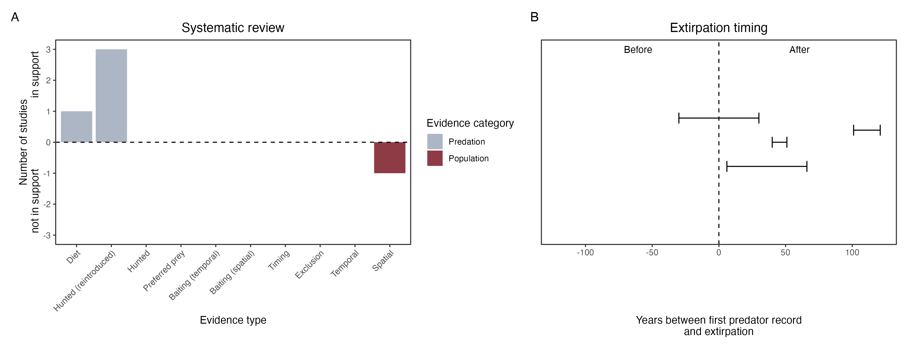

```{css, echo=FALSE}
h1, h2, h3 {
  text-align: center;
}
```

## **Rufous hare-wallaby**
### *Lagorchestes hirsutus*
### Blamed on cats

:::: {style="display: flex;"}

::: {}
  ```{r icon, echo=FALSE, fig.cap="", out.width = '100%'}
  knitr::include_graphics("assets/phylopics/PLACEHOLDER_ready.png")
  ```
:::

::: {}

:::

::: {}
  ```{r map, echo=FALSE, fig.cap="", out.width = '100%'}
  
  ```
:::

::::
<center>
IUCN Status: **Vulnerable**

EPBC Threat Rating: **Moderate**

IUCN Claim: *'On the mainland, predation by introduced feral Cat and Red Foxes was the major cause of extinction in the wild''*

</center>

### Studies in support

Cats were the main predator of reintroduced, predator-inexperienced, hare-wallabies in two locations (Gibson et al. 1994; Hardman & Moro 2006; Hardman et al. 2016). Cats can hunt locally-born wallabies (Paltridge et al. 1997). Hare-wallabies were last confirmed in south-west Australia 58 years after foxes arrived (Wallach et al. 202X).

### Studies not in support

Lundie-Jenkins et al. (1993) found no spatial correlation one year, and a positive correlation another year, between cats and hare-wallabies. Cats breached the enclosures of two semi-captive hare-wallaby colonies, none were hunted in 5-8 weeks (from Moseby et al. 2015). Hare-wallabies were last confirmed in the Tanami Desert 106 years after cats arrived (Wallach et al. 202X).

### Is the threat claim evidence-based?

There are no studies evidencing a negative association between cats and rufous hare-wallaby population. The fate of reintroduced animals is not a reliable proxy for the fate of populations. In contradiction with the claim, the two species co-occurred for over half-a-century in one locale and for over a century in another.
<br>
<br>



### References

Gibson, D.F., Lundie-Jenkins, J., Langford, D., Cole, J.R. & Johnson, K.A. (1994) Predation by feral cats, Felis catus, on the rufous hare-wallaby, Lagorchestes hirsutus,

Lundie-Jenkins, G; Corbett, LK; Phillips, CM (1993). Ecology of the rufous hare-wallaby, Lagorchestes hirsutus Gould (Marsupialia : Macropodidae) in the Tanami Desert, Northern Territory. III Interactions with introduced mammal species.. Wildlife Research, 20(4), 495–. doi:10.1071/WR9930495 

Moseby, K.E., Peacock, D.E. and Read, J.L., 2015. Catastrophic cat predation: a call for predator profiling in wildlife protection programs. Biological Conservation, 191, pp.331-340.

Hardman, Blair, Dorian Moro, and Mike Calver. "Direct evidence implicates feral cat predation as the primary cause of failure of a mammal reintroduction programme." Ecological Management & Restoration 17.2 (2016): 152-158.

Hardman, Blair, and Dorian Moro. "Optimising reintroduction success by delayed dispersal: is the release protocol important for hare-wallabies?." Biological Conservation 128.3 (2006): 403-411.

Paltridge, R., Gibson, D., & Edwards, G. (1997). Diet of the Feral Cat (Felis catus) in Central Australia. Wildlife Research, 24(1), 67. doi:10.1071/wr96023 

Wallach et al. 2023 In Submission

