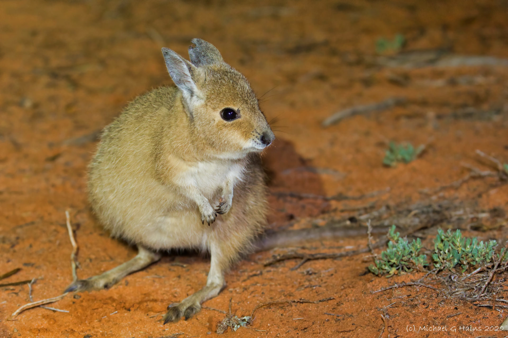

```{css, echo=FALSE}
h1, h2, h3 {
  text-align: center;
}
```

## **Rufous hare-wallaby**
### *Lagorchestes hirsutus*
### Blamed on cats

:::: {style="display: flex;"}

[](https://www.inaturalist.org/photos/60046491?size=original)

::: {}

:::

::: {}
  ```{r map, echo=FALSE, fig.cap="", out.width = '100%'}
  knitr::include_graphics("assets/figures/Map_Cat_Lagorchestes hirsutus.png")
  ```
:::

::::
<center>
IUCN status: **Vulnerable**

EPBC Predator Threat Rating: **Moderate**

IUCN claim: *"On the mainland, predation by introduced feral Cat and Red Foxes was the major cause of extinction in the wild"*

</center>

### Studies in support

Cats were predators, or the main predators, of reintroduced, predator-inexperienced, hare-wallabies in two locations (Gibson et al. 1994; Hardman & Moro 2006; Hardman et al. 2016). Cats can hunt locally-born wallabies (Paltridge et al. 1997). Hare-wallabies were last confirmed in southwest Australia, the Canning Stock Route and the Tanami Desert 6-66, 40-51 and 101-121 years after cats arrived, respectively (Current submission).

### Studies not in support

Lundie-Jenkins et al. (1993) found no spatial correlation one year, and a positive correlation another year, between cats and hare-wallabies. Cats breached the enclosures of two semi-captive hare-wallaby colonies, none were hunted in 5-8 weeks (from Moseby et al. 2015). Hare-wallabies were last confirmed in one WA record 30 years before, to 30 years after, cats arrived (Current submission).

### Is the threat claim evidence-based?

No studies were found evidencing a negative association between cats and rufous hare-wallaby populations. The fate of reintroduced animals is not a reliable proxy for the fate of populations. In one region it cannot be verified that extirpation occurred after cat arrival, and in another the two species possibly co-occurred for over a century before extirpation.
<br>
<br>

![**Evidence linking *Lagorchestes hirsutus* to cats.** **A.** Systematic review of evidence for an association between *Lagorchestes hirsutus* and cats. Positive studies are in support of the hypothesis that cats contribute to the decline of *Lagorchestes hirsutus*, negative studies are not in support. Predation studies include studies documenting hunting or scavenging; baiting studies are associations between poison baiting and threatened mammal abundance where information on predator abundance is not provided; population studies are associations between threatened mammal and predator abundance. **B.** Last records of extirpated populations relative to earliest local records of cats. Error bars show minimum and maximum extinction intervals. Predator arrival records were digitized from Abbott 2008. See methods section in [current submission] for details on evidence categories.](assets/figures/Main_Evidence_Cat_Lagorchestes hirsutus.png)

### References

Abbott, The spread of the cat, Felis catus, in Australia: re-examination of the current conceptual model with additional information. Conservation Science Western Australia 7 (2008).

Current submission (2023) Scant evidence that introduced predators cause extinctions.

EPBC. (2015) Threat Abatement Plan for Predation by Feral Cats. Environment Protection and Biodiversity Conservation Act 1999, Department of Environment, Government of Australia. (Table A1).

Gibson, D.F., Lundie-Jenkins, G., Langford, D.G., Cole, J.R. and Johnson, K.A., 1994. Predation by feral cats, Felis catus, on the rufous hare-wallaby, Lagorchestes hirsutus, in the Tanami Desert. Australian Mammalogy, 17(1), pp.103-107.

Hardman, B. and Moro, D., 2006. Optimising reintroduction success by delayed dispersal: is the release protocol important for hare-wallabies?. Biological Conservation, 128(3), pp.403-411.

Hardman, B., Moro, D. and Calver, M., 2016. Direct evidence implicates feral cat predation as the primary cause of failure of a mammal reintroduction programme. Ecological Management & Restoration, 17(2), pp.152-158.

IUCN Red List. https://www.iucnredlist.org/ Accessed June 2023

Lundie-Jenkins, G., Corbett, L.K., Phillips, C.M. 1993. Ecology of the rufous hare-wallaby, Lagorchestes hirsutus Gould (Marsupialia : Macropodidae) in the Tanami Desert, Northern Territory. III Interactions with introduced mammal species. Wildlife Research, 20(4), pp 495-511.

Paltridge, R., Gibson, D. and Edwards, G., 1997. Diet of the feral cat (Felis catus) in central Australia. Wildlife Research, 24(1), pp.67-76.

