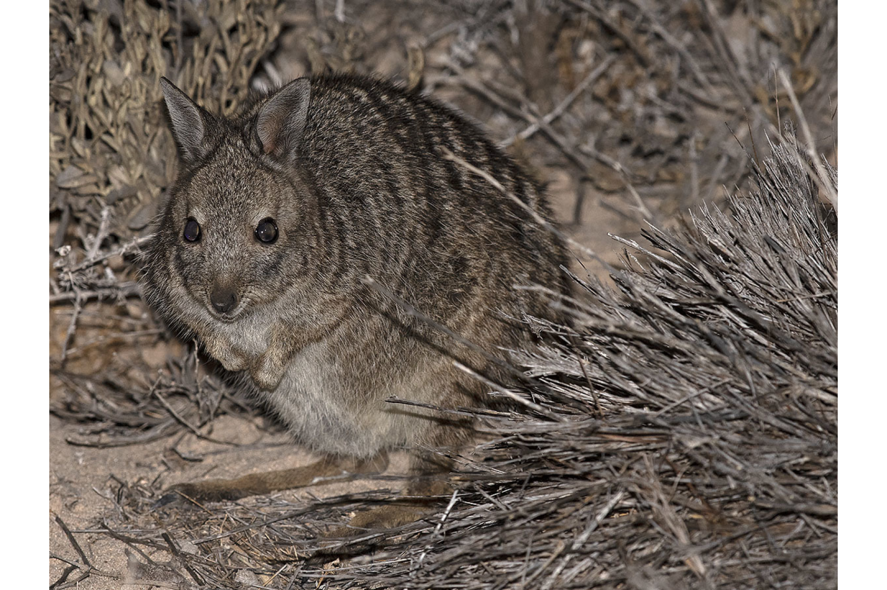

```{css, echo=FALSE}
h1, h2, h3 {
  text-align: center;
}
```

## **Banded hare-wallaby**
### *Lagostrophus fasciatus*
### Blamed on cats

:::: {style="display: flex;"}

[](https://www.inaturalist.org/photos/96201735?size=original)

::: {}

:::

::: {}
  ```{r map, echo=FALSE, fig.cap="", out.width = '100%'}
  
  ```
:::

::::
<center>
IUCN status: **Vulnerable**

EPBC Predator Threat Rating: **Moderate**

IUCN claim: *"The species presumably was extirpated from mainland Australia by a combination of predation by the Red Fox and feral cat and habitat disturbance."*

</center>

### Studies in support

Cats were the main cause of mortality of a reintroduced, predator-inexperienced, hare-wallaby group (Hardman et al. 2016). Hare-wallabies were last confirmed on the mainland in Western Australia 28-68 years after cats arrived (Current submission).

### Studies not in support

No studies

### Is the threat claim evidence-based?

There are no studies evidencing a negative association between banded hare-wallabies and cats. The fate of reintroduced animals is not a reliable proxy for the fate of populations. The two species co-occurred for over half a century in one locale.
<br>
<br>

![**Evidence linking *Lagostrophus fasciatus* to cats.** **A.** Systematic review of evidence for an association between *Lagostrophus fasciatus* and cats. Positive studies are in support of the hypothesis that cats contribute to the decline of *Lagostrophus fasciatus*, negative studies are not in support. Predation studies include studies documenting hunting or scavenging; baiting studies are associations between poison baiting and threatened mammal abundance where information on predator abundance is not provided; population studies are associations between threatened mammal and predator abundance. **B.** Last records of extirpated populations relative to earliest local records of cats. Error bars show record uncertainty range. Predator arrival records were digitized from Abbott 2008. See methods section in [current submission] for details on evidence categories.](assets/figures/Main_Evidence_Cat_Lagostrophus fasciatus.png)

### References

Abbott, The spread of the cat, Felis catus, in Australia: re-examination of the current conceptual model with additional information. Conservation Science Western Australia 7 (2008).

Current submission (2023) Scant evidence that introduced predators cause extinctions.

EPBC. (2015) Threat Abatement Plan for Predation by Feral Cats. Environment Protection and Biodiversity Conservation Act 1999, Department of Environment, Government of Australia. (Table A1).

Hardman, B., Moro, D. and Calver, M., 2016. Direct evidence implicates feral cat predation as the primary cause of failure of a mammal reintroduction programme. Ecological Management & Restoration, 17(2), pp.152-158.

IUCN Red List. https://www.iucnredlist.org/ Accessed June 2023

