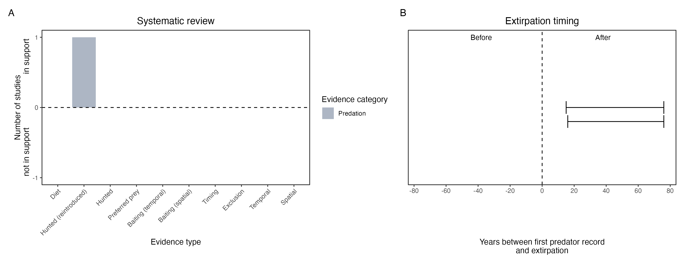

```{css, echo=FALSE}
h1, h2, h3 {
  text-align: center;
}
```

## **Banded hare-wallaby**
### *Lagostrophus fasciatus*

:::: {style="display: flex;"}

::: {}
  ```{r icon, echo=FALSE, fig.cap="", out.width = '100%'}
  knitr::include_graphics("assets/phylopics/PLACEHOLDER_ready.png")
  ```
:::

::: {}

:::

::: {}
  ```{r map, echo=FALSE, fig.cap="", out.width = '100%'}
  knitr::include_graphics("assets/figures/Map_Cat_Lagostrophus fasciatus.png")
  ```
:::

::::
<center>
IUCN Status: **Vulnerable**

EPBC Threat Rating: **Moderate**

IUCN Claim: *The species presumably was extirpated from mainland Australia by a combination of predation by the Red Fox and feral cat and habitat disturbance.'*

</center>

### Studies in support

Cats were the main cause of mortality of a reintroduced, predator-inexperienced, hare-wallaby group (Hardman et al. 2016). Hare-wallabies were last confirmed on the mainland in Western Australia 28-68 years after cats arrived (Wallach et al. 202X).

### Studies not in support

No studies

### Is the threat claim evidence-based?

There are no studies evidencing a negative association between banded hare-wallabies and cats. The fate of reintroduced animals is is not a reliable proxy for the fate of populations.
<br>
<br>



### References

Hardman, Blair, Dorian Moro, and Mike Calver. "Direct evidence implicates feral cat predation as the primary cause of failure of a mammal reintroduction programme." Ecological Management & Restoration 17.2 (2016): 152-158.

Wallach et al. 2023 In Submission

