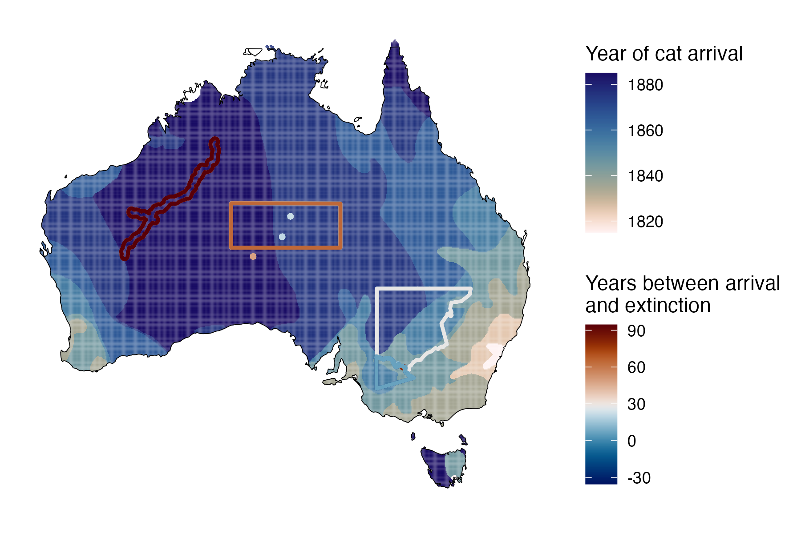

```{css, echo=FALSE}
h1, h2, h3 {
  text-align: center;
}
```

## **Lesser stick-nest rat**
### *Leporillus apicalis*
### Blamed on cats

:::: {style="display: flex;"}

::: {}
  ```{r icon, echo=FALSE, fig.cap="", out.width = '100%'}
  knitr::include_graphics("assets/phylopics/PLACEHOLDER_ready.png")
  ```
:::

::: {}

:::

::: {}
  ```{r map, echo=FALSE, fig.cap="", out.width = '100%'}
  
  ```
:::

::::

<center>
IUCN Status: **Extinct**

Last Seen: *Leporillus apicalis were last seen in 1933 in Norman Tindale, near Mt Crombie, south of the Musgrave Ranges in north-western South Australia*

</center>


### Studies in support

Lesser stick-nest rats were last confirmed in the NT, NSW, Victoria and SA 7-48 years after cats arrived (Wallach et al. 202X).

### Studies not in support

No studies

### Is the threat claim evidence-based?

There are no studies evidencing a link between cats and the extinction of lesser stick-nest rats.
<br>
<br>


### References

Abbott, The spread of the cat, Felis catus, in Australia: re-examination of the current conceptual model with additional information. Conservation Science Western Australia 7 (2008).

Wallach et al. 2023 In Submission

