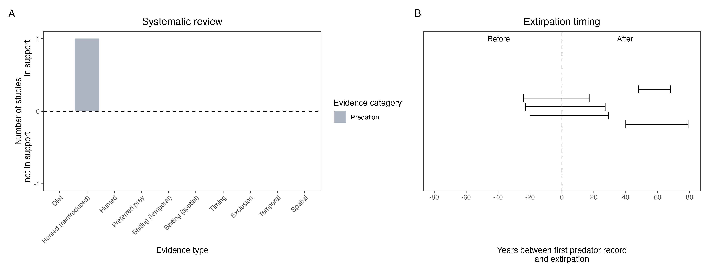

```{css, echo=FALSE}
h1, h2, h3 {
  text-align: center;
}
```

## **Greater stick-nest rat**
### *Leporillus conditor*
### Blamed on cats

:::: {style="display: flex;"}

::: {}
  ```{r icon, echo=FALSE, fig.cap="", out.width = '100%'}
  knitr::include_graphics("assets/phylopics/PLACEHOLDER_ready.png")
  ```
:::

::: {}

:::

::: {}
  ```{r map, echo=FALSE, fig.cap="", out.width = '100%'}
  knitr::include_graphics("assets/figures/Map_Cat_Leporillus conditor.png")
  ```
:::

::::
<center>
IUCN Status: **Near Threatened**

EPBC Threat Rating: **Moderate**

IUCN Claim: *'The major threat for L. conditor is predation by feral cats and red foxes.''*

</center>

### Studies in support

Cats were among predators of reintroduced captive-bred stick-nest rats (Copley 1999). Stick-nest rats were last confirmed in the Nullarbor, Murray-Darling, Flinders Ranges, and NSW 5-53 years after cats arrived (Wallach et al. 202X).

### Studies not in support

Stick-nest rats were last confirmed in NSW 18 years before cats arrived (Wallach et al. 202X).

### Is the threat claim evidence-based?

There are no studies linking cats to stick-nest rat populations. In contradiction with the claim, the NSW extipration record pre-dates the cat arrival record, and in one locale the two species co-occurred for over half-a-century.
<br>
<br>



### References

Copley, P. (1999). Natural histories of Australia’s stick-nest rats, genus Leporillus (Rodentia : Muridae). Wildlife Research, 26(4), 513. doi:10.1071/wr97056

Wallach et al. 2023 In Submission

