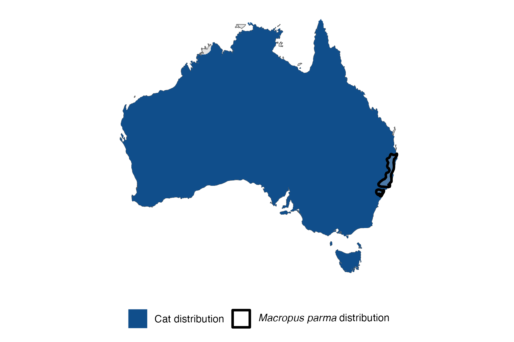
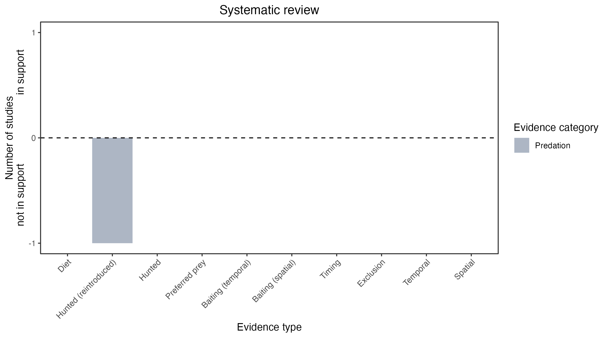

```{css, echo=FALSE}
h1, h2, h3 {
  text-align: center;
}
```

## **Parma wallaby**
### *Macropus parma*
### Blamed on cats

:::: {style="display: flex;"}

::: {}
  ```{r icon, echo=FALSE, fig.cap="", out.width = '100%'}
  knitr::include_graphics("assets/phylopics/PLACEHOLDER_ready.png")
  ```
:::

::: {}

:::

::: {}
  ```{r map, echo=FALSE, fig.cap="", out.width = '100%'}
  
  ```
:::

::::
<center>
IUCN Status: **Near Threatened**

EPBC Threat Rating: **Moderate**

IUCN Claim: *'N/A''*

</center>

### Studies in support

No studies

### Studies not in support

No studies

### Is the threat claim evidence-based?

There are no studies linking cats to parma wallabies.
<br>
<br>



### References

Short, J., Bradshaw, S. D., Giles, J., Prince, R. I. T., & Wilson, G. R. (1992). Reintroduction of macropods (Marsupialia: Macropodoidea) in Australia—a review. Biological conservation, 62(3), 189-204.

Wallach et al. 2023 In Submission

