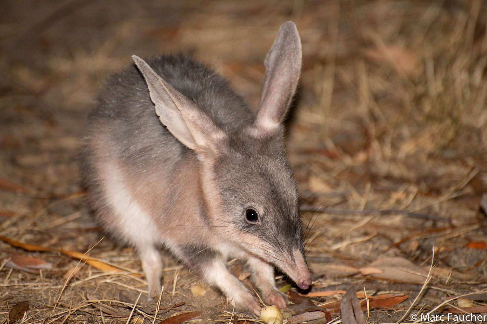

```{css, echo=FALSE}
h1, h2, h3 {
  text-align: center;
}
```

## **Bilby**
### *Macrotis lagotis*
### Blamed on cats

:::: {style="display: flex;"}

[](https://www.inaturalist.org/photos/30690836?size=original)

::: {}

:::

::: {}
  ```{r map, echo=FALSE, fig.cap="", out.width = '100%'}
  knitr::include_graphics("assets/figures/Map_Cat_Macrotis lagotis.png")
  ```
:::

::::
<center>
IUCN status: **Vulnerable**

EPBC Predator Threat Rating: **Very high/Extreme**

IUCN claim: *"The major threat to the Bilby is predation by introduced red foxes and feral cats"*

</center>

### Studies in support

Bilbies reintroduced inside fenced reserves (excluding foxes, cats and dingoes) have improved survival rates (Moseby et al. 2011). Cat predation was a regular cause of mortality for mostly predator-inexperienced reintroduced bilbies at two sites (Moseby et al. 2011; Lohr et al. 2021). Cats were documented hunting reintroduced bilbies in another study (Moseby et al. 2012) and hunting locally-born bilbies (Paltridge 2005; Paltridge et al. 1997; Wysong 2016; Murphy et al. 2019). Paltridge et al. (2020) found fewer cats where humans hunt them, and suggested that this could be why bilbies still occur in that region, but no data was providing linking cats and bilbies when cat hunting was monitored. Bilbies were last confirmed in the Western Division of NSW, Wagga Wagga, Koonchera Dune and the Nullarbor 13-73, 57-97, 46-66 and 43-73 years after cats arrived, respectively; and at 47 sites across Australia they were last recorded a minimum average of 40.3 years to a maximum average of 111 years after cats arrived (Current submission).

### Studies not in support

Cat and bilby populations were not negatively correlated in four studies (Paltridge 2005; Southgate et al. 2007; Geyle et al 2024; Moore et al 2024). Bilbies were successfully reintroduced into a fenced reserve where cats occurred (Richards 2012). Moseby et al. (2019) reported a positive correlation between cat and bilby abundance within a fenced reserve and bilby recruitment was confirmed despite evidence of cat predation. Paltridge et al. (2020) did not identify bilby remains in the stomachs of 47 cats and in 50 cat scats. A cat breached the fence of a semi-captive bilby enclosure, none of which were hunted during one month (from Moseby et al. 2015). Bilbies were last confirmed in the Murray-Darling 24 years before, to 17 years after, cats arrived (Current submission).

### Is the threat claim evidence-based?

No studies were found evidencing a negative association between  cats and bilby populations. The fate of reintroduced animals is not a reliable proxy for the fate of populations. In contradiction with the claim, no negative association was found between the two species. In one region it cannot be verified that extirpation occurred after cat arrival, and multiple records suggest the two species co-occurred for over a century prior to extirpation.
<br>
<br>

![**Evidence linking *Macrotis lagotis* to cats.** **A.** Systematic review of evidence for an association between *Macrotis lagotis* and cats. Positive studies are in support of the hypothesis that cats contribute to the decline of *Macrotis lagotis*, negative studies are not in support. Predation studies include studies documenting hunting or scavenging; baiting studies are associations between poison baiting and threatened mammal abundance where information on predator abundance is not provided; population studies are associations between threatened mammal and predator abundance. **B.** Last records of extirpated populations relative to earliest local records of cats. Error bars show minimum and maximum extinction intervals. Predator arrival records were digitized from Abbott 2008. See methods section in [current submission] for details on evidence categories.](assets/figures/Main_Evidence_Cat_Macrotis lagotis.png)

### References

Abbott, The spread of the cat, Felis catus, in Australia: re-examination of the current conceptual model with additional information. Conservation Science Western Australia 7 (2008).

Current submission (2023) Scant evidence that introduced predators cause extinctions.

EPBC. (2015) Threat Abatement Plan for Predation by Feral Cats. Environment Protection and Biodiversity Conservation Act 1999, Department of Environment, Government of Australia. (Table A1).

Geyle, H.M., Schlesinger, C., Banks, S., Dixon, K., Murphy, B.P., Paltridge, R., Doolan, L., Herbert, M. and Dickman, C.R., 2024. Corrigendum to: Unravelling predator–prey interactions in response to planned fire: a case study from the Tanami Desert. Wildlife Research, 51(9), pp.NULL-NULL.

IUCN Red List. https://www.iucnredlist.org/ Accessed June 2023

Lohr, C.A., Dziminski, M., Dunlop, J., Miller, E. and Morris, K., 2021. Reintroduction of bilbies (Macrotis lagotis) to Matuwa, an Indigenous Protected Area in Western Australia. Rangeland Ecology & Management, 78, pp.67-78.

Moore, H.A., Gibson, L.A., Dziminski, M.A., Radford, I.J., Corey, B., Bettink, K., Carpenter, F.M., McPhail, R., Sonneman, T. and Greatwich, B., 2024. Where there’s smoke, there’s cats: long-unburnt habitat is crucial to mitigating the impacts of cats on the Ngarlgumirdi, greater bilby (Macrotis lagotis). Wildlife Research, 51(5).

Moseby, K.E., Cameron, A. and Crisp, H.A., 2012. Can predator avoidance training improve reintroduction outcomes for the greater bilby in arid Australia?. Animal Behaviour, 83(4), pp.1011-1021.

Moseby, K.E., Letnic, M., Blumstein, D.T. and West, R., 2019. Understanding predator densities for successful co‐existence of alien predators and threatened prey. Austral Ecology, 44(3), pp.409-419.

Moseby, K.E., Peacock, D.E. and Read, J.L., 2015. Catastrophic cat predation: a call for predator profiling in wildlife protection programs. Biological Conservation, 191, pp.331-340.

Moseby, K.E., Read, J.L., Paton, D.C., Copley, P., Hill, B.M. and Crisp, H.A., 2011. Predation determines the outcome of 10 reintroduction attempts in arid South Australia. Biological Conservation, 144(12), pp.2863-2872.

Murphy, B.P., Woolley, L.A., Geyle, H.M., Legge, S.M., Palmer, R., Dickman, C.R., Augusteyn, J., Brown, S.C., Comer, S., Doherty, T.S. and Eager, C., 2019. Introduced cats (Felis catus) eating a continental fauna: the number of mammals killed in Australia. Biological Conservation, 237, pp.28-40.

Paltridge, R., 2002. The diets of cats, foxes and dingoes in relation to prey availability in the Tanami Desert, Northern Territory. Wildlife Research, 29(4), pp.389-403.

Paltridge, R., Ward, N.N., West, J.T. and Crossing, K., 2020. Is cat hunting by Indigenous tracking experts an effective way to reduce cat impacts on threatened species?. Wildlife Research, 47(8), pp.709-719.

Paltridge, R.M., 2005. Predator-prey interactions in the spinifex grasslands of central Australia. PhD Thesis, University of Wollongong

Richards, J.D., 2012. Western Barred Bandicoot, Burrowing Bettong and Banded Hare-wallaby Recovery Team, Department of Environment and Conservation (Western Australia), and the Australian Government Department of Sustainability, Environment, Water, Population and Communities.

Southgate, R., Paltridge, R., Masters, P. and Carthew, S., 2007. Bilby distribution and fire: a test of alternative models of habitat suitability in the Tanami Desert, Australia. Ecography, 30(6), pp.759-776.

Wysong, M.L., 2016. Predator ecology in the arid rangelands of Western Australia: spatial interactions and resource competition between an apex predator, the dingo Canis dingo, and an introduced mesopredator, the feral cat Felis catus. PhD thesis, University of Western Australia, Perth.

