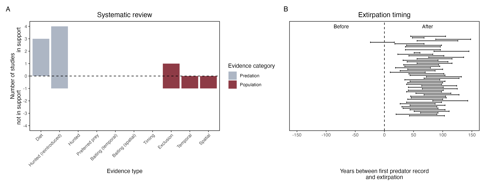

```{css, echo=FALSE}
h1, h2, h3 {
  text-align: center;
}
```

## **Bilby**
### *Macrotis lagotis*
### Blamed on cats

:::: {style="display: flex;"}

::: {}
  ```{r icon, echo=FALSE, fig.cap="", out.width = '100%'}
  knitr::include_graphics("assets/phylopics/PLACEHOLDER_ready.png")
  ```
:::

::: {}

:::

::: {}
  ```{r map, echo=FALSE, fig.cap="", out.width = '100%'}
  knitr::include_graphics("assets/figures/Map_Cat_Macrotis lagotis.png")
  ```
:::

::::
<center>
IUCN Status: **Vulnerable**

EPBC Threat Rating: **Very high/Extreme**

IUCN Claim: *'The major threat to the Bilby is predation by introduced red foxes and feral cats''*

</center>

### Studies in support

Bilbies reintroduced inside fenced reserves (excluding foxes, cats and dingoes) have improved survival rates (Moseby et al. 2011). Cat predation was a regular cause of mortality for mostly predator-inexperienced reintroduced bilbies at two sites (Moseby et al. 2011; Lohr et al. 2021). Cats were documented hunting reintroduced bilbies in another study (Moseby et al. 2012) and hunting locally-born bilbies (Paltridge et al. 1997; Wysong 2016; Murphy et al. 2019). The last record of bilby populations is, on average, 58 years after cats arrived, including one population that co-occurred for a century (Wallach et al. 202X).

### Studies not in support

Cat probability of occurrence did not predict bilby occurrence (Southgate et al. 2007). Bilbies were successfully reintroduced into a fenced reserve where cats occur (Richards 2012). Moseby et al. (2019) reported a positive correlation between cat and bilby abundance within a fenced reserve, despite evidence of predation, and bilby recruitment was confirmed. A cat breached the fence of semi-captive bilby enclosure, none of which were hunted in 1 month (from Moseby et al. 2015).

### Is the threat claim evidence-based?

There are no studies evidencing a negative association between  cats and bilby populations. The fate of reintroduced animals is not a reliable proxy for the fate of populations. In contradiction with the claim, no negative association was found between the two species, which have co-occured for a century in one locale.
<br>
<br>



### References

Lohr, Cheryl A., et al. "Reintroduction of Bilbies (Macrotis lagotis) to Matuwa, an Indigenous Protected Area in Western Australia." Rangeland Ecology & Management 78 (2021): 67-78.

Southgate, Richard, et al. "Bilby distribution and fire: a test of alternative models of habitat suitability in the Tanami Desert, Australia." Ecography 30.6 (2007): 759-776

Wysong ML. 2016. Predator ecology in the arid rangelands of Western Australia: spatial interactions and resource competition between an apex predator, the dingo Canis dingo, and an introduced mesopredator, the feral cat Felis catus. PhD thesis, University of Western Australia, Perth.

Moseby, Katherine E., Amber Cameron, and Helen A. Crisp. "Can predator avoidance training improve reintroduction outcomes for the greater bilby in arid Australia?." Animal Behaviour 83.4 (2012): 1011-1021.

Moseby, K. E., et al. "Predation determines the outcome of 10 reintroduction attempts in arid South Australia." Biological Conservation 144.12 (2011): 2863-2872.

Moseby, K. E., D. E. Peacock, and J. L. Read. "Catastrophic cat predation: a call for predator profiling in wildlife protection programs." Biological Conservation 191 (2015): 331-340.

Murphy, Brett P., et al. "Introduced cats (Felis catus) eating a continental fauna: the number of mammals killed in Australia." Biological Conservation 237 (2019): 28-40

Paltridge, Rachel. "The diets of cats, foxes and dingoes in relation to prey availability in the Tanami Desert, Northern Territory." Wildlife Research 29.4 (2002): 389-403

Richards JD (2012). Western Barred Bandicoot, Burrowing Bettong and Banded Hare-wallaby Recovery Team, Department of Environment and Conservation (Western Australia), and the Australian Government Department of Sustainability, Environment, Water, Population and Communities.

Wallach et al. 2023 In Submission

