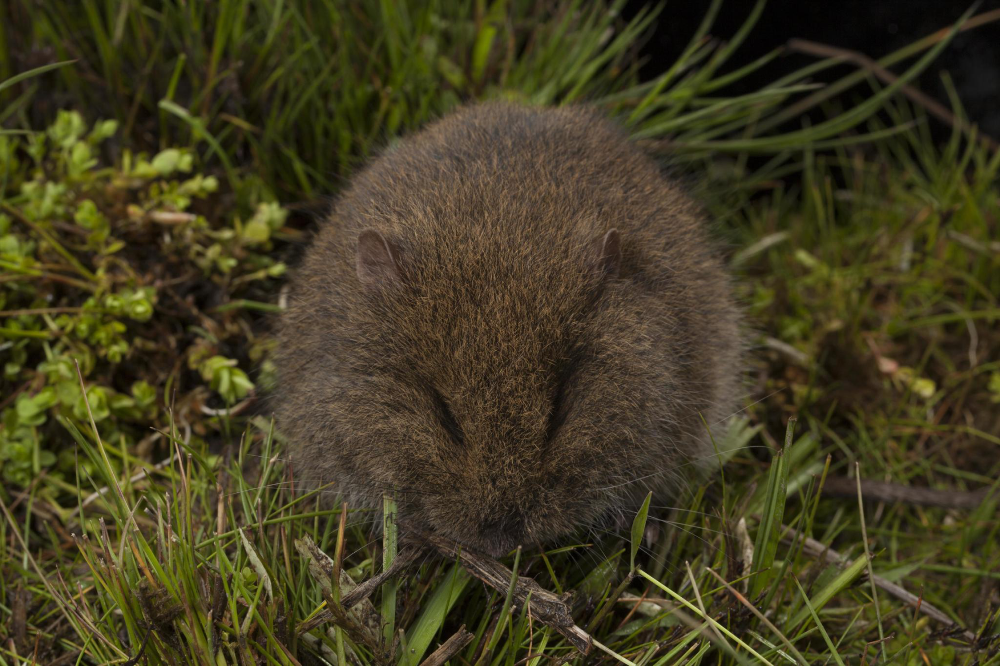

```{css, echo=FALSE}
h1, h2, h3 {
  text-align: center;
}
```

## **Broad-toothed rat**
### *Mastacomys fuscus*
### Blamed on cats

:::: {style="display: flex;"}

[](https://www.inaturalist.org/photos/63617025?size=original)

::: {}

:::

::: {}
  ```{r map, echo=FALSE, fig.cap="", out.width = '100%'}
  
  ```
:::

::::
<center>
IUCN status: **Near Threatened**

EPBC Predator Threat Rating: **High**

IUCN claim: *"The species is threatened by predation from introduced foxes (Vulpes vulpes) (Bubela and Happold 1993, Green 2002) and Domestic Cats (Felis catus) (L. Broome pers. comm., Milner et al. 2015)."*

</center>

### Studies in support

Cats hunt broad-toothed mice (Doherty et al. 2015).

### Studies not in support

No studies

### Is the threat claim evidence-based?

There are no studies linking cats to broad-toothed mouse population trends.
<br>
<br>

![**Evidence linking *Mastacomys fuscus* to cats.** Systematic review of evidence for an association between *Mastacomys fuscus* and cats. Positive studies are in support of the hypothesis that *cats* contribute to the decline of Mastacomys fuscus, negative studies are not in support. Predation studies include studies documenting hunting or scavenging; baiting studies are associations between poison baiting and threatened mammal abundance where information on predator abundance is not provided; population studies are associations between threatened mammal and predator abundance. See methods section in [current submission] for details on evidence categories.](assets/figures/Main_Evidence_Cat_Mastacomys fuscus.png)

### References

Current submission (2023) Scant evidence that introduced predators cause extinctions.

Doherty, T.S., Davis, R.A., van Etten, E.J., Algar, D., Collier, N., Dickman, C.R., Edwards, G., Masters, P., Palmer, R. and Robinson, S., 2015. A continental‐scale analysis of feral cat diet in Australia. Journal of Biogeography, 42(5), pp.964-975.

EPBC. (2015) Threat Abatement Plan for Predation by Feral Cats. Environment Protection and Biodiversity Conservation Act 1999, Department of Environment, Government of Australia. (Table A1).

IUCN Red List. https://www.iucnredlist.org/ Accessed June 2023

