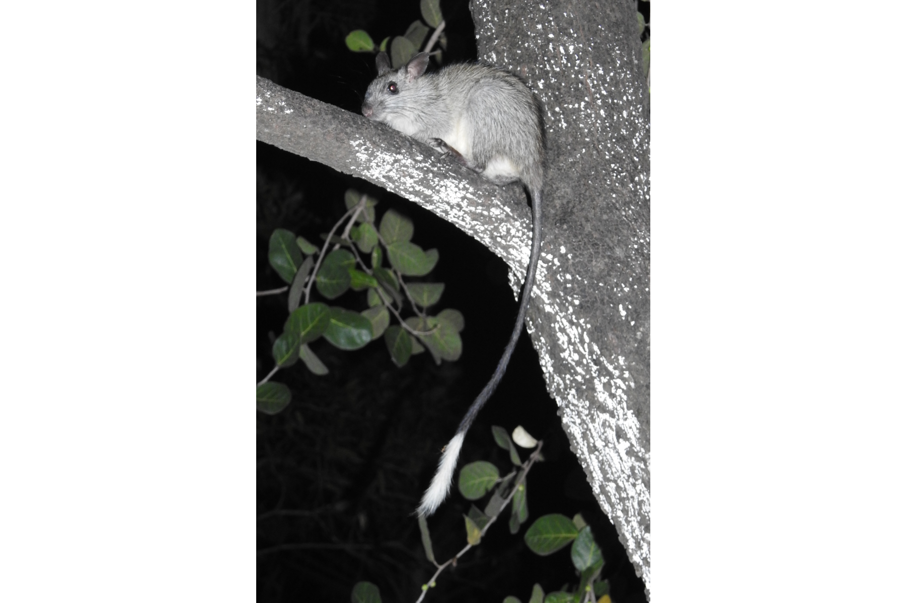

```{css, echo=FALSE}
h1, h2, h3 {
  text-align: center;
}
```

## **Black-footed tree-rat**
### *Mesembriomys gouldii*
### Blamed on cats

:::: {style="display: flex;"}

[](https://www.inaturalist.org/photos/20174315?size=original)

::: {}

:::

::: {}
  ```{r map, echo=FALSE, fig.cap="", out.width = '100%'}
  knitr::include_graphics("assets/figures/Map_Cat_Mesembriomys gouldii.png")
  ```
:::

::::
<center>
IUCN status: **Vulnerable**

EPBC Predator Threat Rating: **High**

IUCN claim: *"Predation by feral cats may also be a threat."*

</center>

### Studies in support

Cats hunt tree-rats (Stokeld et al. 2018). Lower tree-rat occupancy was correlated with higher cat occupancy across Melville Island and north of Northern Territory mainland (Stobo-Wilson et al. 2020a).

### Studies not in support

No relationship between cat detection and tree-rat detection on Melville Island (Davies et al. 2018).

### Is the threat claim evidence-based?

Cats have been documented among a range of ecological variables negatively correlated with black-footed tree rats in one study but not in the other. Causality cannot be inferred due to confounding variables.
<br>
<br>

![**Evidence linking *Mesembriomys gouldii* to cats.** Systematic review of evidence for an association between *Mesembriomys gouldii* and cats. Positive studies are in support of the hypothesis that *cats* contribute to the decline of Mesembriomys gouldii, negative studies are not in support. Predation studies include studies documenting hunting or scavenging; baiting studies are associations between poison baiting and threatened mammal abundance where information on predator abundance is not provided; population studies are associations between threatened mammal and predator abundance.](assets/figures/Main_Evidence_Cat_Mesembriomys gouldii.png)

### References

Current submission (2023) Scant evidence that introduced predators cause extinctions. Conservation Biology

Davies, H.F., McCarthy, M.A., Firth, R.S., Woinarski, J.C., Gillespie, G.R., Andersen, A.N., Rioli, W., Puruntatameri, J., Roberts, W., Kerinaiua, C. and Kerinauia, V., 2018. Declining populations in one of the last refuges for threatened mammal species in northern Australia. Austral Ecology, 43(5), pp.602-612.

EPBC. (2015) Threat Abatement Plan for Predation by Feral Cats. Environment Protection and Biodiversity Conservation Act 1999, Department of Environment, Government of Australia. (Table A1).

IUCN Red List. https://www.iucnredlist.org/ Accessed June 2023

Stobo-Wilson, A.M., Stokeld, D., Einoder, L.D., Davies, H.F., Fisher, A., Hill, B.M., Mahney, T., Murphy, B.P., Scroggie, M.P., Stevens, A. and Woinarski, J.C.Z., 2020. Bottom-up and top-down processes influence contemporary patterns of mammal species richness in Australia's monsoonal tropics. Biological Conservation, 247, p.108638.

Stokeld D, Fisher A, Gentles T, Hill B, Triggs B, Woinarski JCZ, Gillespie GR. 2018. What do predator diets tell us about mammal declines in Kakadu National Park? Wildlife Research 45:92-101.

