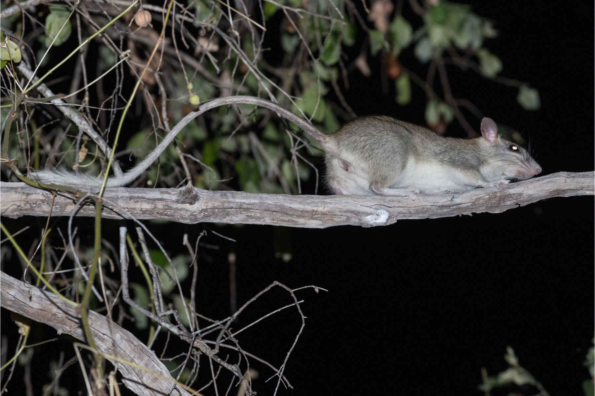

```{css, echo=FALSE}
h1, h2, h3 {
  text-align: center;
}
```

## **Golden-backed tree-rat**
### *Mesembriomys macrurus*
### Blamed on cats

:::: {style="display: flex;"}

[](https://www.inaturalist.org/photos/59888454?size=original)

::: {}

:::

::: {}
  ```{r map, echo=FALSE, fig.cap="", out.width = '100%'}
  
  ```
:::

::::
<center>
IUCN status: **Near Threatened**

EPBC Predator Threat Rating: **Not assessed**

IUCN claim: *"Another threat is predation by feral cats (moderate, mainland part of range), which has not been demonstrated, but is highly plausible on the mainland; however, this is somewhat ameliorated by the rugged nature of habitat, which offers some protection from cats, and by partially arboreal behaviour."*

</center>

### Studies in support

No studies

### Studies not in support

No studies

### Is the threat claim evidence-based?

There are no studies linking cats to golden-backed tree-rats.
<br>
<br>

![**Evidence linking *Mesembriomys macrurus* to cats.** Systematic review of evidence for an association between *Mesembriomys macrurus* and cats. Positive studies are in support of the hypothesis that *cats* contribute to the decline of Mesembriomys macrurus, negative studies are not in support. Predation studies include studies documenting hunting or scavenging; baiting studies are associations between poison baiting and threatened mammal abundance where information on predator abundance is not provided; population studies are associations between threatened mammal and predator abundance. See methods section in [current submission] for details on evidence categories.](assets/figures/Main_Evidence_Cat_Mesembriomys macrurus.png)

### References


Current submission (2023) Scant evidence that introduced predators cause extinctions.

IUCN Red List. https://www.iucnredlist.org/ Accessed June 2023

