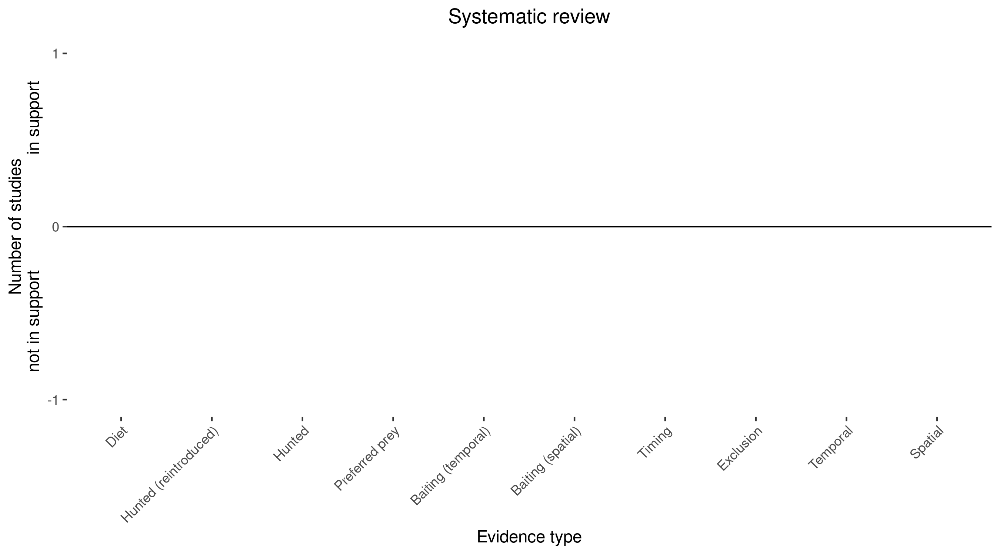

```{css, echo=FALSE}
h1, h2, h3 {
  text-align: center;
}
```

## **Golden-backed tree-rat**
### *Mesembriomys macrurus*
### Blamed on cats

:::: {style="display: flex;"}

::: {}
  ```{r icon, echo=FALSE, fig.cap="", out.width = '100%'}
  knitr::include_graphics("assets/phylopics/PLACEHOLDER_ready.png")
  ```
:::

::: {}

:::

::: {}
  ```{r map, echo=FALSE, fig.cap="", out.width = '100%'}
  knitr::include_graphics("assets/figures/Map_Cat_Mesembriomys macrurus.png")
  ```
:::

::::
<center>
IUCN Status: **Near Threatened**

EPBC Threat Rating: **Moderate**

IUCN Claim: *'Another threat is predation by feral cats (moderate, mainland part of range), which has not been demonstrated, but is highly plausible on the mainland; however, this is somewhat ameliorated by the rugged nature of habitat, which offers some protection from cats, and by partially arboreal behaviour.''*

</center>

### Studies in support

No studies

### Studies not in support

No studies

### Is the threat claim evidence-based?

There are no studies linking cats to golden-backed tree-rats.
<br>
<br>



### References


Wallach et al. 2023 In Submission

