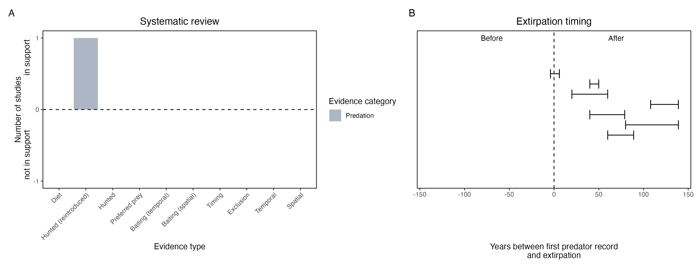

```{css, echo=FALSE}
h1, h2, h3 {
  text-align: center;
}
```

## **Numbat**
### *Myrmecobius fasciatus*
### Blamed on cats

:::: {style="display: flex;"}

::: {}
  ```{r icon, echo=FALSE, fig.cap="", out.width = '100%'}
  knitr::include_graphics("assets/phylopics/PLACEHOLDER_ready.png")
  ```
:::

::: {}

:::

::: {}
  ```{r map, echo=FALSE, fig.cap="", out.width = '100%'}
  knitr::include_graphics("assets/figures/Map_Cat_Myrmecobius fasciatus.png")
  ```
:::

::::
<center>
IUCN Status: **Near Threatened**

EPBC Threat Rating: **Very high**

IUCN Claim: *'The introduction of the predatory Red Fox and feral cats has had a profound impact and continues to be a major threat today (Friend 2008).''*

</center>

### Studies in support

Cats were among predators of reintroduced numbats (Friend & Thomas 1994).Numbats were last confirmed in NSW 25 years after cats arrived (Wallach et al. 202X).

### Studies not in support

No studies

### Is the threat claim evidence-based?

There are no studies linking cats to numbat populations.
<br>
<br>



### References

Friend, J. A., and N. D. Thomas. "Reintroduction and the numbat recovery programme." Reintroduction Biology of Australian and New Zealand Fauna’.(Ed. M. Serena.) pp (1994): 189-198.

Wallach et al. 2023 In Submission

