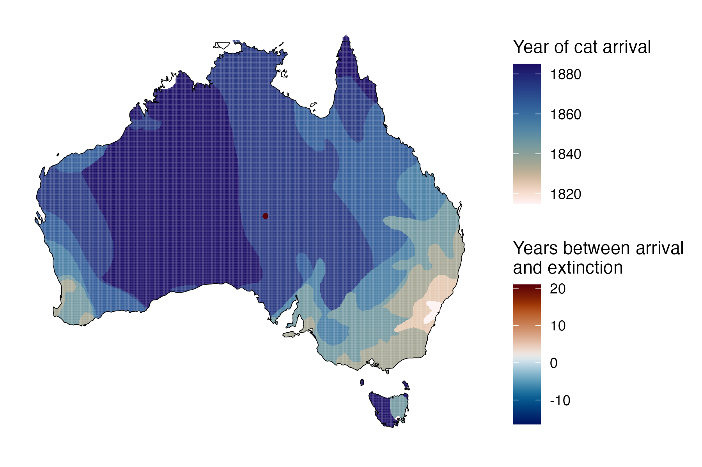

```{css, echo=FALSE}
h1, h2, h3 {
  text-align: center;
}
```

## **Short-tailed hopping mouse**
### *Notomys amplus*
### Blamed on cats

:::: {style="display: flex;"}

::: {}


:::

::: {}

:::

::: {}
  ```{r map, echo=FALSE, fig.cap="", out.width = '100%'}
  
  ```
:::

::::

<center>
IUCN status: **Extinct**

Last seen: *Notomys amplus were last seen in 1896 in Charlotte Waters, NT*

</center>


### Studies in support

Short-tailed hopping mice were last confirmed 21 years after cats arrived (Wallach et al. In Submission).

### Studies not in support

No studies

### Is the threat claim evidence-based?

There are no studies evidencing a link between cats and the extinction of short-tailed hopping mice.
<br>
<br>


### References

Abbott, The spread of the cat, Felis catus, in Australia: re-examination of the current conceptual model with additional information. Conservation Science Western Australia 7 (2008).

Wallach et al. 2023 In Submission

