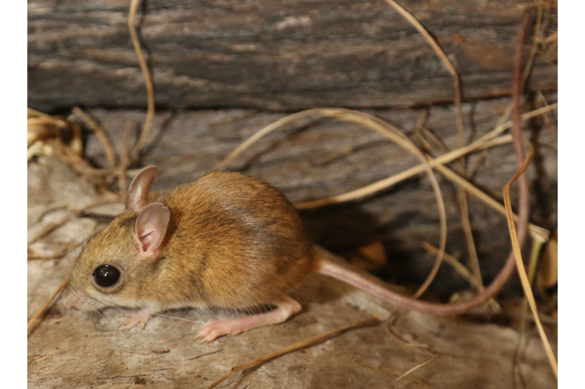

```{css, echo=FALSE}
h1, h2, h3 {
  text-align: center;
}
```

## **Northern hopping mouse**
### *Notomys aquilo*
### Blamed on cats

:::: {style="display: flex;"}

[](https://en.wikipedia.org/wiki/Northern_hopping_mouse#/media/File:Nhm_groote.jpg)

::: {}

:::

::: {}
  ```{r map, echo=FALSE, fig.cap="", out.width = '100%'}
  
  ```
:::

::::
<center>
IUCN status: **Endangered**

EPBC Predator Threat Rating: **Not assessed**

IUCN claim: *"Feral cats, strip-mining (for manganese and bauxite), and changes in the fire regime are threats (Woinarski et al. 2014)"*

</center>

### Studies in support

No studies

### Studies not in support

No studies

### Is the threat claim evidence-based?

No studies were found linking cats to northern hopping mice.
<br>
<br>

![**Evidence linking *Notomys aquilo* to cats.** Systematic review of evidence for an association between *Notomys aquilo* and cats. Positive studies are in support of the hypothesis that *cats* contribute to the decline of Notomys aquilo, negative studies are not in support. Predation studies include studies documenting hunting or scavenging; baiting studies are associations between poison baiting and threatened mammal abundance where information on predator abundance is not provided; population studies are associations between threatened mammal and predator abundance. See methods section in [current submission] for details on evidence categories.](assets/figures/Main_Evidence_Cat_Notomys aquilo.png)

### References


Current submission (2023) Scant evidence that introduced predators cause extinctions.

IUCN Red List. https://www.iucnredlist.org/ Accessed June 2023

