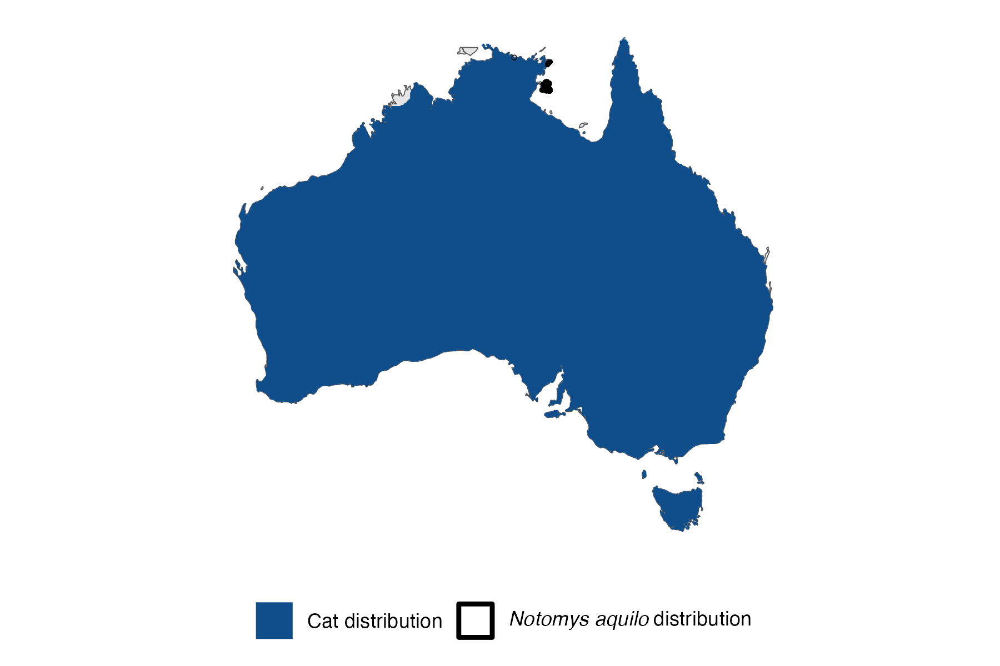

```{css, echo=FALSE}
h1, h2, h3 {
  text-align: center;
}
```

## **Northern hopping mouse**
### *Notomys aquilo*
### Blamed on cats

:::: {style="display: flex;"}

::: {}
  ```{r icon, echo=FALSE, fig.cap="", out.width = '100%'}
  knitr::include_graphics("assets/phylopics/PLACEHOLDER_ready.png")
  ```
:::

::: {}

:::

::: {}
  ```{r map, echo=FALSE, fig.cap="", out.width = '100%'}
  
  ```
:::

::::
<center>
IUCN Status: **Endangered**

EPBC Threat Rating: **Very high**

IUCN Claim: *'Feral cats, strip-mining (for manganese and bauxite), and changes in the fire regime are threats (Woinarski et al. 2014)''*

</center>

### Studies in support

No studies

### Studies not in support

No studies

### Is the threat claim evidence-based?

There are no studies linking cats to northern hopping mice.
<br>
<br>


### References


Wallach et al. 2023 In Submission

