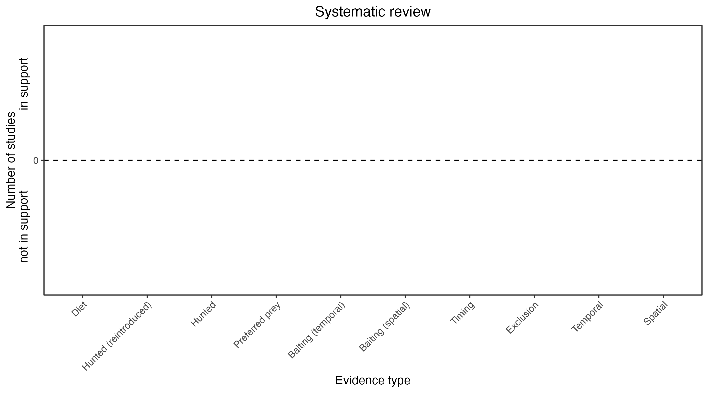

```{css, echo=FALSE}
h1, h2, h3 {
  text-align: center;
}
```

## **Fawn hopping mouse**
### *Notomys cervinus*

:::: {style="display: flex;"}

::: {}
  ```{r icon, echo=FALSE, fig.cap="", out.width = '100%'}
  knitr::include_graphics("assets/phylopics/PLACEHOLDER_ready.png")
  ```
:::

::: {}

:::

::: {}
  ```{r map, echo=FALSE, fig.cap="", out.width = '100%'}
  
  ```
:::

::::
<center>
IUCN Status: **Near Threatened**

EPBC Threat Rating: **High**

IUCN Claim: *The major threat is predation by feral Domestic Cats (Felis catus; moderate, entire range), Red Foxes (Vulpes vulpes; minor, entire range)'*

</center>

### Studies in support

No studies

### Studies not in support

No studies

### Is the threat claim evidence-based?

There are no studies linking cats to fawn hopping mice.
<br>
<br>



### References


Wallach et al. 2023 In Submission

