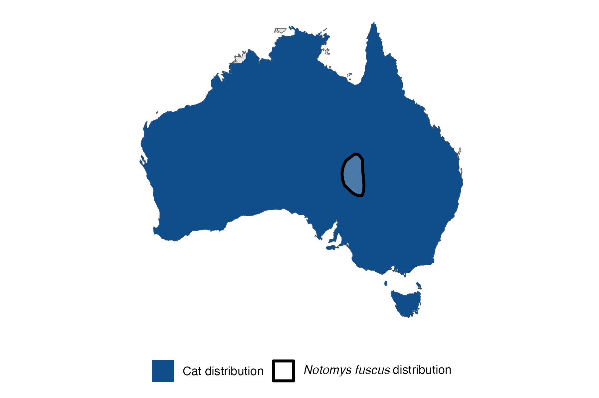

```{css, echo=FALSE}
h1, h2, h3 {
  text-align: center;
}
```

## **Dusky hopping mouse**
### *Notomys fuscus*
### Blamed on cats

:::: {style="display: flex;"}

[](https://www.inaturalist.org/photos/62717923?size=original)

::: {}

:::

::: {}
  ```{r map, echo=FALSE, fig.cap="", out.width = '100%'}
  
  ```
:::

::::
<center>
IUCN status: **Vulnerable**

EPBC Predator Threat Rating: **High/Very High**

IUCN claim: *"Predation by feral Domestic Cats (Felis catus; moderate to severe, across the entire range) and Red Foxes (Vulpes vulpes) represent another major threat"*

</center>

### Studies in support

Cat abundance was negatively correlated with hopping mouse abundance (Gordon et al. 2015). Cats hunt hopping mice (Feit et al. 2019; Vernes et al. 2021a; Vernes et al. 2021b). Hopping mice were last confirmed in NSW 24 years after cats arrived (Current submission).

### Studies not in support

Letnic & Koch (2010) reported that cat abundance was similar outside compared to inside the dingo barrier fence, while hopping mouse abundance was lower outside. Letnic et al. (2009) reported that dingo abundance was positively correlated with hopping-mouse abundance, and cat abundance was positively correlated with dingo abundance, but no direct analysis of hopping mice and cats was provided.

### Is the threat claim evidence-based?

Cats have been documeted among a range of ecological variables both negatively and positively correlated with dusky hopping mice. Causality cannot be determined due to confounding variables.
<br>
<br>

![**Evidence linking *Notomys fuscus* to cats.** **A.** Systematic review of evidence for an association between *Notomys fuscus* and cats. Positive studies are in support of the hypothesis that cats contribute to the decline of *Notomys fuscus*, negative studies are not in support. Predation studies include studies documenting hunting or scavenging; baiting studies are associations between poison baiting and threatened mammal abundance where information on predator abundance is not provided; population studies are associations between threatened mammal and predator abundance. **B.** Last records of extirpated populations relative to earliest local records of cats. Error bars show record uncertainty range. Predator arrival records were digitized from Abbott 2008. See methods section in [current submission] for details on evidence categories.](assets/figures/Main_Evidence_Cat_Notomys fuscus.png)

### References

Abbott, The spread of the cat, Felis catus, in Australia: re-examination of the current conceptual model with additional information. Conservation Science Western Australia 7 (2008).

Current submission (2023) Scant evidence that introduced predators cause extinctions.

EPBC. (2015) Threat Abatement Plan for Predation by Feral Cats. Environment Protection and Biodiversity Conservation Act 1999, Department of Environment, Government of Australia. (Table A1).

Feit, B., Feit, A. and Letnic, M., 2019. Apex predators decouple population dynamics between mesopredators and their prey. Ecosystems, 22, pp.1606-1617.

Gordon, C.E., Feit, A., Grüber, J. and Letnic, M., 2015. Mesopredator suppression by an apex predator alleviates the risk of predation perceived by small prey. Proceedings of the Royal Society B: Biological Sciences, 282(1802), p.20142870.

IUCN Red List. https://www.iucnredlist.org/ Accessed June 2023

Letnic, M. and Koch, F., 2010. Are dingoes a trophic regulator in arid Australia? A comparison of mammal communities on either side of the dingo fence. Austral Ecology, 35(2), pp.167-175.

Letnic, M., Crowther, M.S. and Koch, F., 2009. Does a top‐predator provide an endangered rodent with refuge from an invasive mesopredator?. Animal Conservation, 12(4), pp.302-312.

Vernes, K., Elliott, T.F. and Jackson, S.M., 2021. 150 years of mammal extinction and invasion at Koonchera Dune in the Lake Eyre Basin of South Australia. Biological Invasions, 23(2), pp.593-610.

Vernes, K., Jackson, S.M., Elliott, T.F., Tischler, M. and Harper, A., 2021. Diets of mammalian carnivores in the deserts of north-eastern South Australia. Journal of Arid Environments, 188, p.104377.

