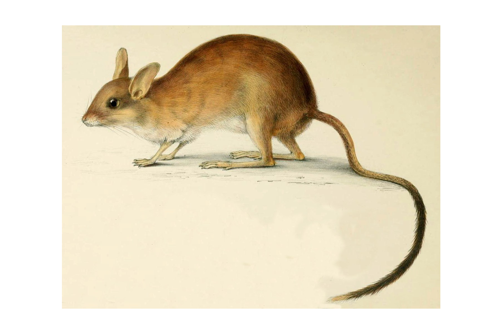
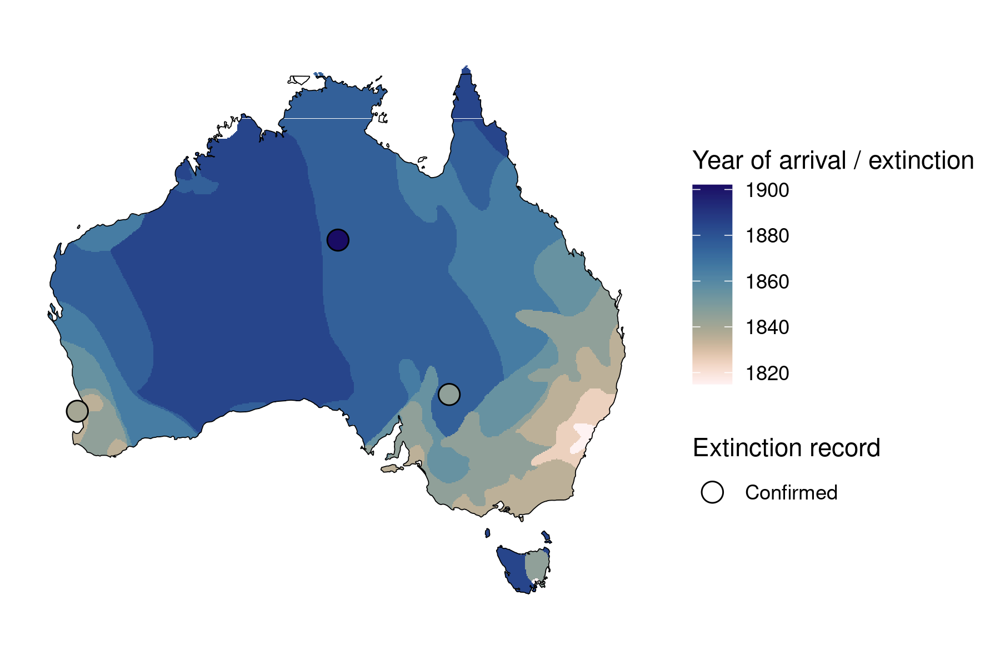
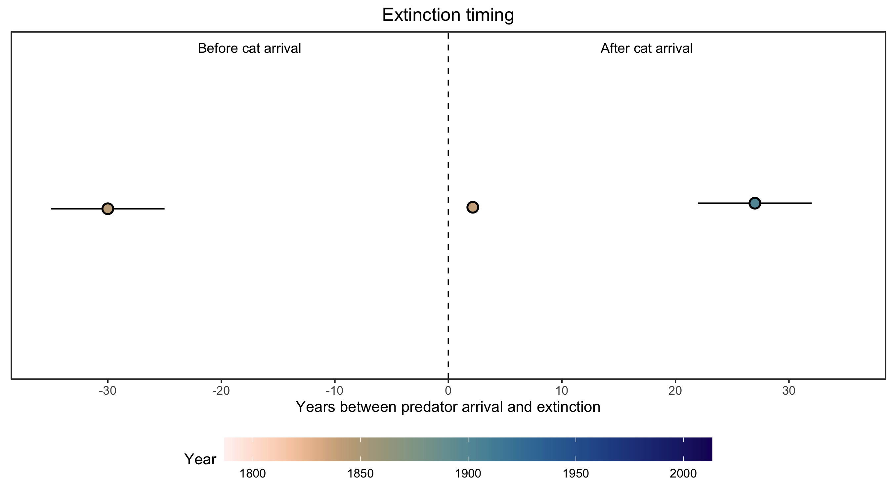

```{css, echo=FALSE}
h1, h2, h3 {
  text-align: center;
}
```

## **Long-tailed hopping mouse**
### *Notomys longicaudatus*
### Blamed on cats

:::: {style="display: flex;"}

::: {}

[](https://en.wikipedia.org/wiki/Long-tailed_hopping_mouse#/media/File:Notomys_longicaudatus.jpg)

:::

::: {}

:::

::: {}
  ```{r map, echo=FALSE, fig.cap="", out.width = '100%'}
  
  ```
:::

::::

<center>
IUCN status: **Extinct**

Last seen: *Notomys longicaudatus were last seen in 1902 (1901-1902) in Barrow Creek, Northern Territory (IUCN 2023)*

IUCN claim: *"Extinction is attributed to predation by feral cats."*

</center>


### Studies in support

Long-tailed hopping mice were last confirmed at Barrow Creek, NT, 21-32 years after cats arrived (Current submission).

### Studies not in support

Long-tailed hopping mice were last confirmed in the Western Division of NSW and southwest Australia 35 and 50 years before, to 15 and 19 years after, cats arrived, respectively (Current submission).

### Is the threat claim evidence-based?

No studies were found evidencing a link between cats and the extinction of long-tailed hopping mice. In two regions it cannot be verified that extirpation occurred after cat arrival.
<br>
<br>



### References


Abbott, The spread of the cat, Felis catus, in Australia: re-examination of the current conceptual model with additional information. Conservation Science Western Australia 7 (2008).

Current submission (2023) Scant evidence that introduced predators cause extinctions.

IUCN Red List. https://www.iucnredlist.org/ Accessed June 2023

