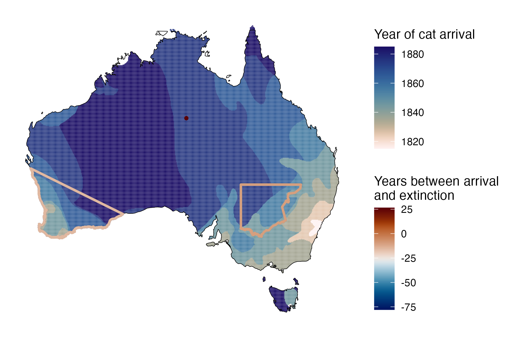
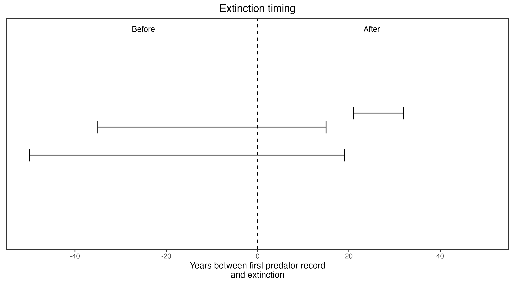

```{css, echo=FALSE}
h1, h2, h3 {
  text-align: center;
}
```

## **Long-tailed hopping mouse**
### *Notomys longicaudatus*
### Blamed on cats

:::: {style="display: flex;"}

::: {}

[](https://en.wikipedia.org/wiki/Long-tailed_hopping_mouse#/media/File:Notomys_longicaudatus.jpg)

:::

::: {}

:::

::: {}
  ```{r map, echo=FALSE, fig.cap="", out.width = '100%'}
  
  ```
:::

::::

<center>
IUCN status: **Extinct**

Last seen: *Notomys longicaudatus were last seen in 1902 in Barrow Creek, Northern Territory*

</center>


### Studies in support

Long-tailed hopping mice were last confirmed in WA and NT 2 and 27 years after cats arrived (Current submission).

### Studies not in support

Long-tailed hopping mice were last confirmed in NSW 30 years before cats arrived (Current submission).

### Is the threat claim evidence-based?

There are no studies evidencing a link between cats and the extinction of long-tailed hopping mice. In contradiction with the claim, the extinction record from NSW pre-dates the cat arrival record.
<br>
<br>



### References

Abbott, The spread of the cat, Felis catus, in Australia: re-examination of the current conceptual model with additional information. Conservation Science Western Australia 7 (2008).

Current submission (2023) Scant evidence that introduced predators cause extinctions. Conservation Biology

IUCN Red List. https://www.iucnredlist.org/ Accessed June 2023

