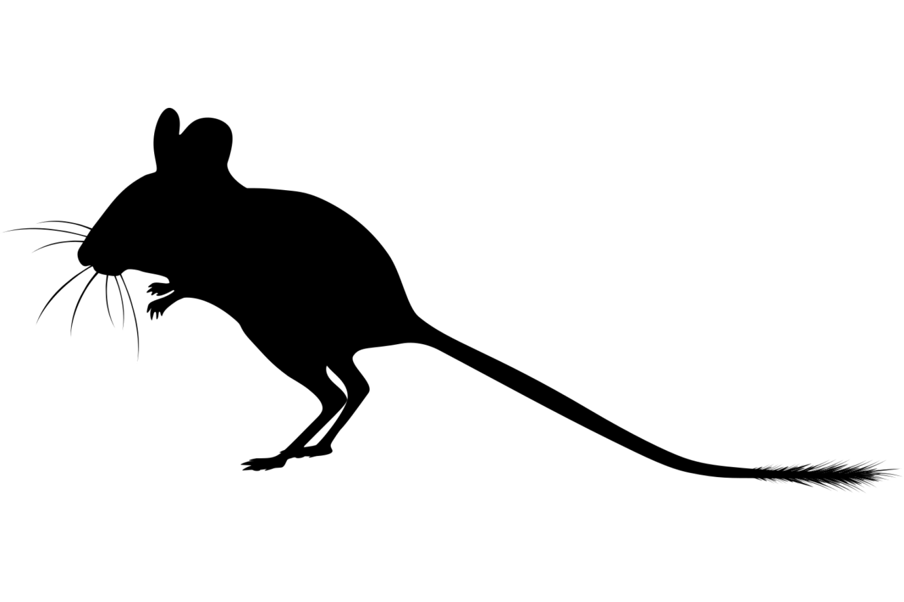
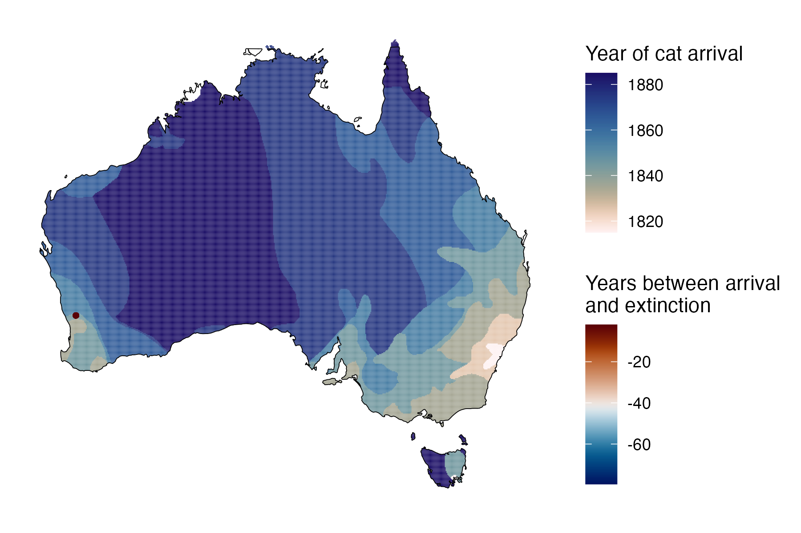
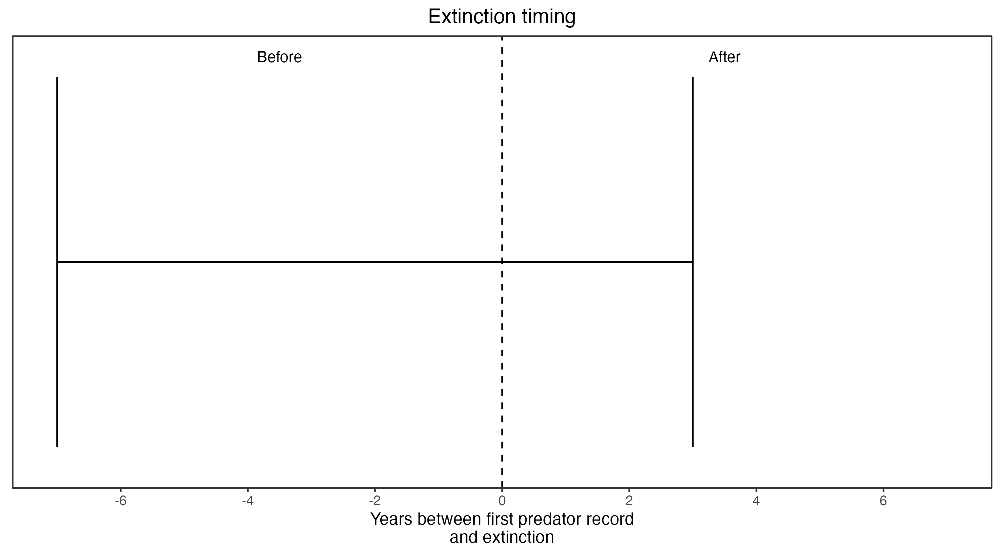

```{css, echo=FALSE}
h1, h2, h3 {
  text-align: center;
}
```

## **Big-eared hopping mouse**
### *Notomys macrotis*
### Blamed on cats

:::: {style="display: flex;"}

::: {}



:::

::: {}

:::

::: {}
  ```{r map, echo=FALSE, fig.cap="", out.width = '100%'}
  
  ```
:::

::::

<center>
IUCN status: **Extinct**

Last seen: *Notomys macrotis were last seen in 1843 in New Norcia, WA (IUCN 2023)*

IUCN claim: *"Extinction is considered to be primarily caused by predation by feral cats."*

</center>


### Studies in support

No studies

### Studies not in support

Big-eared hopping mice were last confirmed one year before cats arrived (Current submission).

### Is the threat claim evidence-based?

There are no studies evidencing a link between cats and the extinction of big-eared hopping mice. In contradiction with the claim, the extinction record pre-dates the cat arrival record.
<br>
<br>



### References

Abbott, The spread of the cat, Felis catus, in Australia: re-examination of the current conceptual model with additional information. Conservation Science Western Australia 7 (2008).

Current submission (2023) Scant evidence that introduced predators cause extinctions.

IUCN Red List. https://www.iucnredlist.org/ Accessed June 2023

