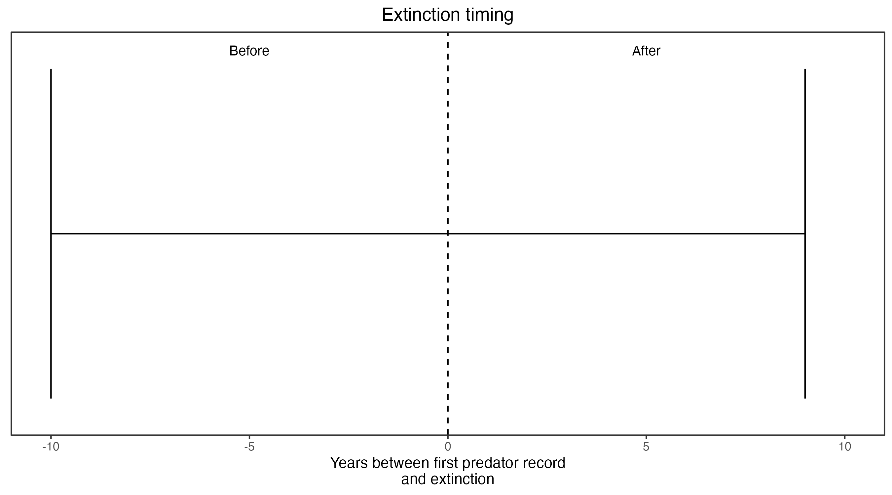

```{css, echo=FALSE}
h1, h2, h3 {
  text-align: center;
}
```

## **Darling Downs hopping mouse**
### *Notomys mordax*
### Blamed on cats

:::: {style="display: flex;"}

::: {}
  ```{r icon, echo=FALSE, fig.cap="", out.width = '100%'}
  knitr::include_graphics("assets/phylopics/PLACEHOLDER_ready.png")
  ```
:::

::: {}

:::

::: {}
  ```{r map, echo=FALSE, fig.cap="", out.width = '100%'}
  knitr::include_graphics("assets/figures/Map_Cat_Notomys mordax.png")
  ```
:::

::::

<center>
IUCN Status: **Extinct**

Last Seen: *Notomys mordax were last seen in 1845 (+- 5 years) in Darling Downs, QLD*

</center>


### Studies in support

No studies

### Studies not in support

Darling Downs hopping mice were last confirmed the same year cats arrived (Wallach et al. 202X).

### Is the threat claim evidence-based?

There are no studies evidencing a link between cats and the extinction of Darling Downs hopping mice. In contradiction with the claim, the extinction record does not follow the cat arrival record.
<br>
<br>



### References

Wallach et al. 2023 In Submission

