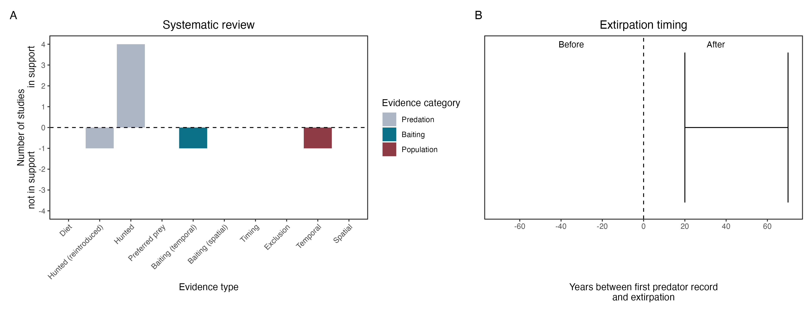

```{css, echo=FALSE}
h1, h2, h3 {
  text-align: center;
}
```

## **Bridled nail-tail wallaby**
### *Onychogalea fraenata*
### Blamed on cats

:::: {style="display: flex;"}

::: {}
  ```{r icon, echo=FALSE, fig.cap="", out.width = '100%'}
  knitr::include_graphics("assets/phylopics/PLACEHOLDER_ready.png")
  ```
:::

::: {}

:::

::: {}
  ```{r map, echo=FALSE, fig.cap="", out.width = '100%'}
  
  ```
:::

::::
<center>
IUCN Status: **Vulnerable**

EPBC Threat Rating: **Very high**

IUCN Claim: *'The species is threatened by introduced predators, the Red Fox and feral Cat especially''*

</center>

### Studies in support

Cats hunt them (Horsup & Evans 1993; Fisher 1999; Fisher et al. 2001; Augusteyn et al. 2022). Wallabies were last confirmed in NSW 25 years after cats arrived (Wallach et al. 202X).

### Studies not in support

No correlation was found between cat and wallaby abundance (Augusteyn et al. 2022). No evidence was found that killing cats promotes wallaby abundance (Augusteyn et al. 2022). Cats were not among predators of reintroduced, predator-inexperienced wallabies (Hayward et al. 2012).

### Is the threat claim evidence-based?

There are no studies linking cats to nail-tail wallaby populations.
<br>
<br>



### References

Hayward, Matt W., et al. "Reintroduction of bridled nailtail wallabies beyond fences at Scotia Sanctuary-Phase 1." Proceedings of the Linnean Society of New South Wales. Vol. 134. 2012.

Horsup, A., and M. Evans. "Predation by feral cats, Felis catus, on an endangered marsupial, the bridled nailtail wallaby, Onychogalea fraenata." Australian Mammalogy 16.1 (1993): 83-84

Fisher, D. O. "Behavioural ecology and demography of the bridled nailtail wallaby." Onychogalea fraenata (1999).

Fisher, Diana O., Simon Phillip Blomberg, and Simon David Hoyle. "Mechanisms of drought-induced population decline in an endangered wallaby." Biological Conservation 102.1 (2001): 107-115

Augusteyn, John, et al. "Bringing back the endangered bridled nail-tailed wallaby at Taunton National Park (Scientific) through effective predator control." Wildlife Research (2022).

Wallach et al. 2023 In Submission

