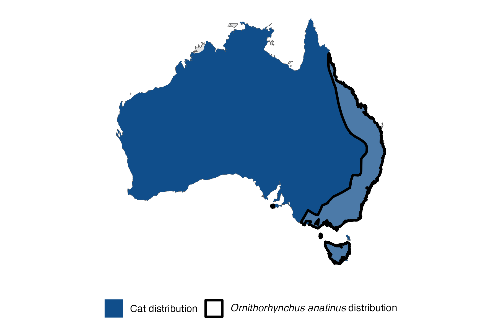

```{css, echo=FALSE}
h1, h2, h3 {
  text-align: center;
}
```

## **Platypus**
### *Ornithorhynchus anatinus*
### Blamed on cats

:::: {style="display: flex;"}

::: {}
  ```{r icon, echo=FALSE, fig.cap="", out.width = '100%'}
  knitr::include_graphics("assets/phylopics/PLACEHOLDER_ready.png")
  ```
:::

::: {}

:::

::: {}
  ```{r map, echo=FALSE, fig.cap="", out.width = '100%'}
  
  ```
:::

::::
<center>
IUCN Status: **Near Threatened**

EPBC Threat Rating: **N/A**

IUCN Claim: *"Across its range, the Platypus is also subject to predation by the introduced Red Fox, dogs and cats.'"*

</center>

### Studies in support

No studies

### Studies not in support

No studies

### Is the threat claim evidence-based?

There are no studies linking cats to platypus.
<br>
<br>

![ Systematic review of evidence for an association between *Ornithorhynchus anatinus* and cats. Positive studies are in support of the hypothesis that *cats* contribute to the decline of Ornithorhynchus anatinus, negative studies are not in support. Predation studies include studies documenting hunting or scavenging; baiting studies are associations between poison baiting and threatened mammal abundance where information on predator abundance is not provided; population studies are associations between threatened mammal and predator abundance.](assets/figures/Main_Evidence_Cat_Ornithorhynchus anatinus.png)

### References


Wallach et al. 2023 In Submission

