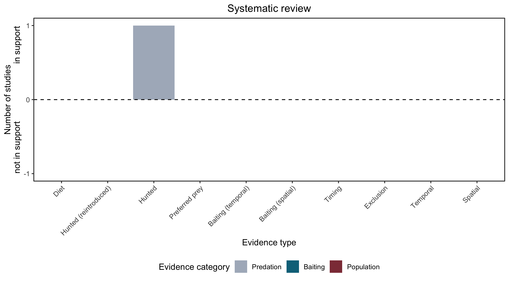

```{css, echo=FALSE}
h1, h2, h3 {
  text-align: center;
}
```

## **Dibbler**
### *Parantechinus apicalis*

:::: {style="display: flex;"}

::: {}
  ```{r icon, echo=FALSE, fig.cap="", out.width = '100%'}
  knitr::include_graphics("assets/phylopics/PLACEHOLDER_ready.png")
  ```
:::

::: {}

:::

::: {}
  ```{r map, echo=FALSE, fig.cap="", out.width = '100%'}
  knitr::include_graphics("assets/figures/Map_Cat_Parantechinus apicalis.png")
  ```
:::

::::
<center>
IUCN Status: **Endangered**

EPBC Threat Rating: **High**

IUCN Claim: *Introduced foxes and cats are known to prey on this species'*

</center>

### Studies in support

Cats hunt dibblers (Woolley 1977).

### Studies not in support

No studies

### Is the threat claim evidence-based?

There are no studies linking cats to dibbler populations.
<br>
<br>



### References

Friend T. 2003. Dibbler (Parantechinus apicalis) Recovery Plan July 2003–June 2013. Wildlife Management Program.

Wallach et al. 2023 In Submission

