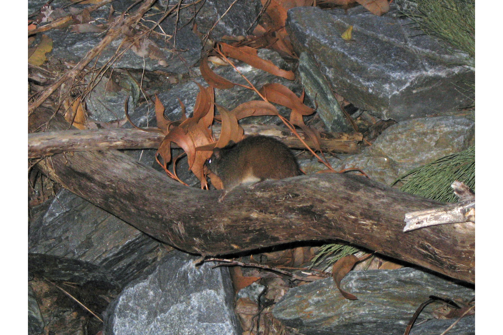

```{css, echo=FALSE}
h1, h2, h3 {
  text-align: center;
}
```

## **Dibbler**
### *Parantechinus apicalis*
### Blamed on cats

:::: {style="display: flex;"}

[](https://www.inaturalist.org/photos/74523679?size=original)

::: {}

:::

::: {}
  ```{r map, echo=FALSE, fig.cap="", out.width = '100%'}
  
  ```
:::

::::
<center>
IUCN status: **Endangered**

EPBC Predator Threat Rating: **High**

IUCN claim: *"Introduced foxes and cats are known to prey on this species"*

</center>

### Studies in support

Cats hunt dibblers (Friend 2003).

### Studies not in support

No studies

### Is the threat claim evidence-based?

There are no studies linking cats to dibbler population trends.
<br>
<br>

![**Evidence linking *Parantechinus apicalis* to cats.** Systematic review of evidence for an association between *Parantechinus apicalis* and cats. Positive studies are in support of the hypothesis that *cats* contribute to the decline of Parantechinus apicalis, negative studies are not in support. Predation studies include studies documenting hunting or scavenging; baiting studies are associations between poison baiting and threatened mammal abundance where information on predator abundance is not provided; population studies are associations between threatened mammal and predator abundance. See methods section in [current submission] for details on evidence categories.](assets/figures/Main_Evidence_Cat_Parantechinus apicalis.png)

### References

Current submission (2023) Scant evidence that introduced predators cause extinctions.

EPBC. (2015) Threat Abatement Plan for Predation by Feral Cats. Environment Protection and Biodiversity Conservation Act 1999, Department of Environment, Government of Australia. (Table A1).

Friend T. 2003. Dibbler (Parantechinus apicalis) Recovery Plan July 2003–June 2013. Wildlife Management Program. Department of Conservation and Land Management Western Australian Threatened Species and Communities Unit

IUCN Red List. https://www.iucnredlist.org/ Accessed June 2023

