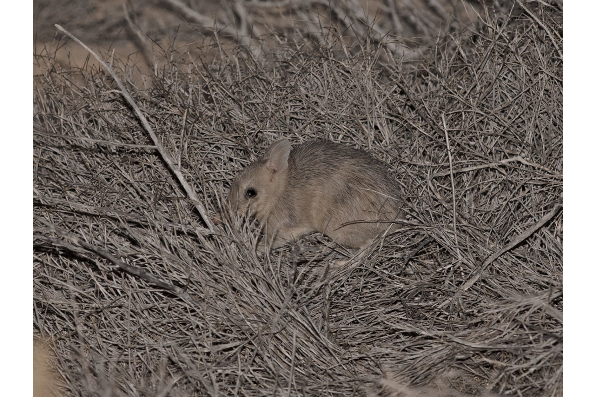

```{css, echo=FALSE}
h1, h2, h3 {
  text-align: center;
}
```

## **Western barred bandicoot**
### *Perameles bougainville*
### Blamed on cats

:::: {style="display: flex;"}

[](https://www.inaturalist.org/photos/96420107?size=original)

::: {}

:::

::: {}
  ```{r map, echo=FALSE, fig.cap="", out.width = '100%'}
  
  ```
:::

::::
<center>
IUCN status: **Vulnerable**

EPBC Predator Threat Rating: **Moderate**

IUCN claim: *"The current major threats to the natural subpopulations of the species include: the accidental introduction of predators (introduced cats and foxes)"*

</center>

### Studies in support

Short (2016) described that the incursion of cats into a fenced reserve led to the loss of the entire group of semi-captive, predator-inexperienced bandicoots, but no data was provided. Richards (2012) described that the incursion of cats into a fenced reserve led to population decline, which recovered once cats were killed, but no data was provided. Bandicoots were last confirmed in the Nullarbor, WA and SA 44-68 years after cats arrived (Current submission).

### Studies not in support

Bandicoots were reintroduced successfully into a fenced reserve with cats (defined as low density) and no evidence of predation was recorded (Richards & Short 2003). Bandicoots were last confirmed in NSW 18 years before cats arrived (Current submission).

### Is the threat claim evidence-based?

There are no studies evidencing a negative association between cats and western barred bandicoot populations. The fate of reintroduced animals is not a reliable proxy for the fate of populations. In contradiction with the claim, two extirpation records pre-date the fox arrival records.
<br>
<br>

![**Evidence linking *Perameles bougainville* to cats.** **A.** Systematic review of evidence for an association between *Perameles bougainville* and cats. Positive studies are in support of the hypothesis that cats contribute to the decline of *Perameles bougainville*, negative studies are not in support. Predation studies include studies documenting hunting or scavenging; baiting studies are associations between poison baiting and threatened mammal abundance where information on predator abundance is not provided; population studies are associations between threatened mammal and predator abundance. **B.** Last records of extirpated populations relative to earliest local records of cats. Error bars show record uncertainty range. Predator arrival records were digitized from Abbott 2008.](assets/figures/Main_Evidence_Cat_Perameles bougainville.png)

### References

Abbott, The spread of the cat, Felis catus, in Australia: re-examination of the current conceptual model with additional information. Conservation Science Western Australia 7 (2008).

Current submission (2023) Scant evidence that introduced predators cause extinctions. Conservation Biology

EPBC. (2015) Threat Abatement Plan for Predation by Feral Cats. Environment Protection and Biodiversity Conservation Act 1999, Department of Environment, Government of Australia. (Table A1).

IUCN Red List. https://www.iucnredlist.org/ Accessed June 2023

Richards, J., 2012. Western barred bandicoot Perameles bougainville, burrowing bettong Bettongia lesueur and banded hare-wallaby Lagostrophus fasciatus National Recovery Plan. Wildlife Management Program, (49).

Richards, J.D. and Short, J., 2003. Reintroduction and establishment of the western barred bandicoot Perameles bougainville (Marsupialia: Peramelidae) at Shark Bay, Western Australia. Biological Conservation, 109(2), pp.181-195.

Short, J., 2016. Predation by feral cats key to the failure of a long-term reintroduction of the western barred bandicoot (Perameles bougainville). Wildlife Research, 43(1), pp.38-50.

