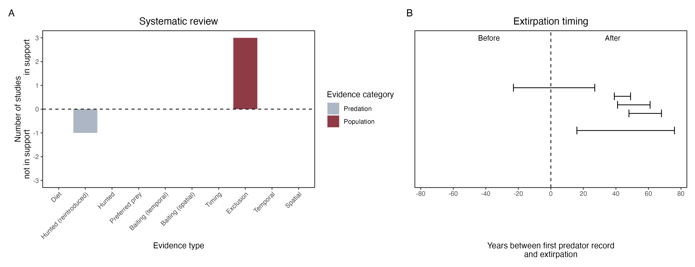

```{css, echo=FALSE}
h1, h2, h3 {
  text-align: center;
}
```

## **Western barred bandicoot**
### *Perameles bougainville*
### Blamed on cats

:::: {style="display: flex;"}

::: {}
  ```{r icon, echo=FALSE, fig.cap="", out.width = '100%'}
  knitr::include_graphics("assets/phylopics/PLACEHOLDER_ready.png")
  ```
:::

::: {}

:::

::: {}
  ```{r map, echo=FALSE, fig.cap="", out.width = '100%'}
  knitr::include_graphics("assets/figures/Map_Cat_Perameles bougainville.png")
  ```
:::

::::
<center>
IUCN Status: **Vulnerable**

EPBC Threat Rating: **Moderate**

IUCN Claim: *'The current major threats to the natural subpopulations of the species include: the accidental introduction of predators (introduced cats and foxes)''*

</center>

### Studies in support

Short (2016) described that the incursion of cats into a fenced reserve led to the loss of the entire group of semi-captive, predator-inexperienced bandicoots, but no data was provided. Richards (2012) described that the incursion of cats into a fenced reserve led to population decline, which recovered once cats were killed, but no data was provided. Bandicoots were last confirmed in the Nullarbor, WA and SA 44-68 years after cats arrived (Wallach et al. 202X).

### Studies not in support

Bandicoots were reintroduced successfully into a fenced reserve with cats (defined as low density) and no evidence of predation was recorded (Richards & Short 2003). Bandicoots were last confirmed in NSW 18 years before cats arrived (Wallach et al. 202X).

### Is the threat claim evidence-based?

There are no studies evidencing a negative association between cats and western barred bandicoot populations. The fate of reintroduced animals is not a reliable proxy for the fate of populations. In contradiction with the claim, two extirpation records pre-date the fox arrival records.
<br>
<br>



### References

Short, Jeff. "Predation by feral cats key to the failure of a long-term reintroduction of the western barred bandicoot (Perameles bougainville)." Wildlife Research 43.1 (2016): 38-50.

Richards, J.D. and Short, J. (2003). Reintroduction and establishment of the western barred bandicoot Perameles bougainville (Marsupialia: Peramelidae) at Shark Bay, Western Australia. Biological Conservation 109: 181-195.

Richards JD (2012). Western Barred Bandicoot, Burrowing Bettong and Banded Hare-wallaby Recovery Team, Department of Environment and Conservation (Western Australia), and the Australian Government Department of Sustainability, Environment, Water, Population and Communities.

Wallach et al. 2023 In Submission

