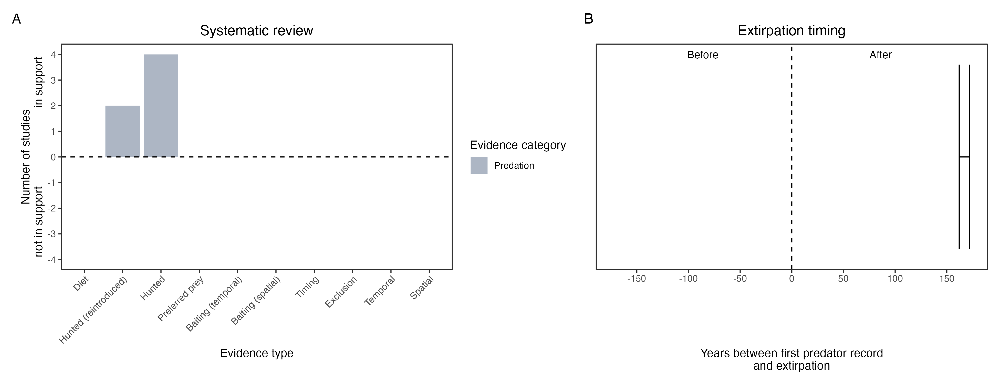

```{css, echo=FALSE}
h1, h2, h3 {
  text-align: center;
}
```

## **Eastern barred bandicoot**
### *Perameles gunnii*

:::: {style="display: flex;"}

::: {}
  ```{r icon, echo=FALSE, fig.cap="", out.width = '100%'}
  knitr::include_graphics("assets/phylopics/PLACEHOLDER_ready.png")
  ```
:::

::: {}

:::

::: {}
  ```{r map, echo=FALSE, fig.cap="", out.width = '100%'}
  knitr::include_graphics("assets/figures/Map_Cat_Perameles gunnii.png")
  ```
:::

::::
<center>
IUCN Status: **Vulnerable**

EPBC Threat Rating: **Very high**

IUCN Claim: *Eastern Barred Bandicoots probably disappeared from the mainland due to introduced predators and habitat destruction from introduced herbivores. Predation from red foxes is thought to have been particularly detrimental, and the recent introduction of foxes to Tasmania could pose a major threat to the species here. '*

</center>

### Studies in support

Cats hunt locally-born bandicoots (Lenghaus et al. 1990; Dufty 1994; Schwarz 1995; Woolley et al. 2019) and reintroduced bandicoots (Lenghaus et al. 1990; Winnard & Coulson 2008; Groenewegen et al. 2017).

### Studies not in support

Bandicoots have co-occurred with cats on Tasmania since 1820 and on the mainland for 167 years (Wallach et al. 202X).

### Is the threat claim evidence-based?

There are no studies liking cats with eastern barred bandicoot populations. In contradiction with the claim, the two species continue to co-occur in Tasmania after over two centuries and they co-occurred on the mainland for over a century-and-a-half.
<br>
<br>



### References

Schwarz E. 1995. Habitat use in a population of mainland Tasmanian feral cats, Felis catus. Grad.Dip. (Hons.) thesis. University of Tasmania, Hobart.

Dufty, Anthony C. "Population demography of the eastern barred bandicoot (Perameles gunnii) at Hamilton, Victoria." Wildlife Research 21.4 (1994): 445-457

Woolley, Leigh‐Ann, et al. "Introduced cats Felis catus eating a continental fauna: inventory and traits of Australian mammal species killed." Mammal Review 49.4 (2019): 354-368

Lenghaus, Cornelis, David L. Obendorf, and Frank H. Wright. "Veterinary aspects of Perameles gunnii biology with special reference to species conservation." Management and Conservation of Small Populations. Chicago Zoological Society, Brookfield, Illinois (1990): 89-108.

Groenewegen, Rebecca, et al. "Assisted colonisation trial of the eastern barred bandicoot (Perameles gunnii) to a fox-free island." Wildlife Research 44.7 (2017): 484-496.

Winnard, Amy L., and Graeme Coulson. "Sixteen years of Eastern Barred Bandicoot Perameles gunnii reintroductions in Victoria: a review." Pacific Conservation Biology 14.1 (2008): 34-53.

Wallach et al. 2023 In Submission

