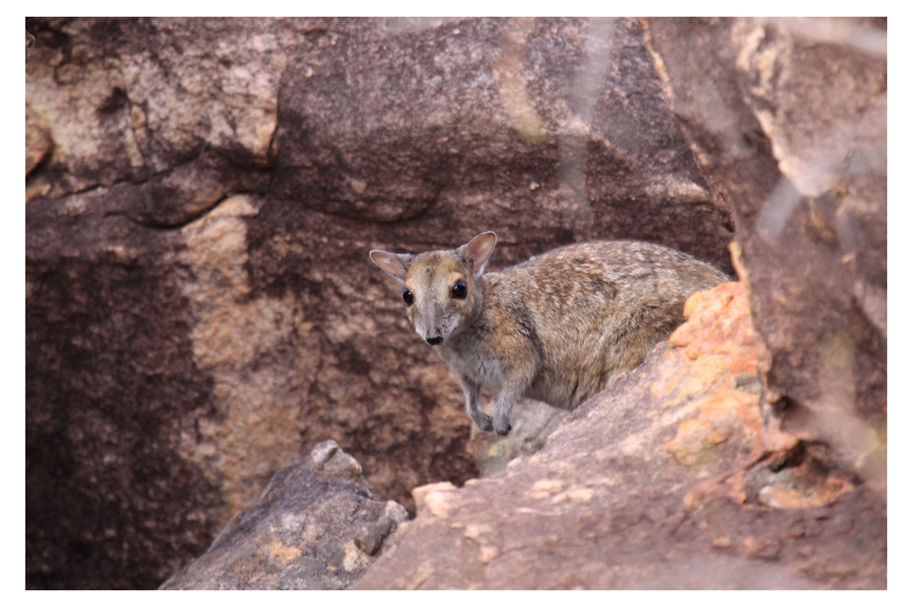

```{css, echo=FALSE}
h1, h2, h3 {
  text-align: center;
}
```

## **Monjon**
### *Petrogale burbidgei*
### Blamed on cats

:::: {style="display: flex;"}

[](https://www.inaturalist.org/photos/66336793?size=original)

::: {}

:::

::: {}
  ```{r map, echo=FALSE, fig.cap="", out.width = '100%'}
  
  ```
:::

::::
<center>
IUCN status: **Near Threatened**

EPBC Threat Rating: **High**

IUCN claim: *"Predation by feral cats may be affecting abundance on the mainland"*

</center>

### Studies in support

No studies

### Studies not in support

No studies

### Is the threat claim evidence-based?

There are no studies linking cats to monjons.
<br>
<br>

![**Evidence linking *Petrogale burbidgei* to cats.** Systematic review of evidence for an association between *Petrogale burbidgei* and cats. Positive studies are in support of the hypothesis that *cats* contribute to the decline of Petrogale burbidgei, negative studies are not in support. Predation studies include studies documenting hunting or scavenging; baiting studies are associations between poison baiting and threatened mammal abundance where information on predator abundance is not provided; population studies are associations between threatened mammal and predator abundance.](assets/figures/Main_Evidence_Cat_Petrogale burbidgei.png)

### References


Current submission (2023) Scant evidence that introduced predators cause extinctions. Conservation Biology

EPBC. (2015) Threat Abatement Plan for Predation by Feral Cats. Environment Protection and Biodiversity Conservation Act 1999, Department of Environment, Government of Australia. (Table A1).

