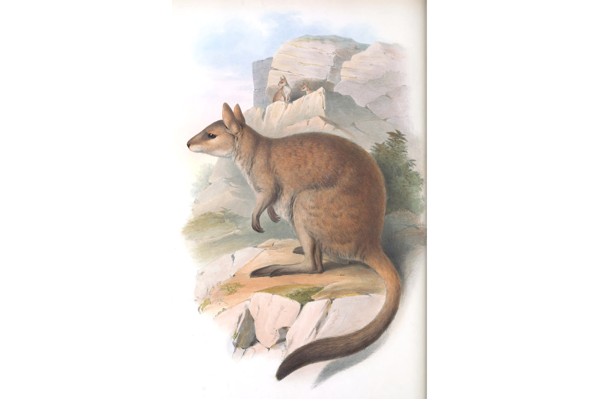

```{css, echo=FALSE}
h1, h2, h3 {
  text-align: center;
}
```

## **Nabarlek**
### *Petrogale concinna*
### Blamed on cats

:::: {style="display: flex;"}

[](https://www.inaturalist.org/photos/114216997?size=original)

::: {}

:::

::: {}
  ```{r map, echo=FALSE, fig.cap="", out.width = '100%'}
  knitr::include_graphics("assets/figures/Map_Cat_Petrogale concinna.png")
  ```
:::

::::
<center>
IUCN status: **Endangered**

EPBC Predator Threat Rating: **High**

IUCN claim: *"Predation by feral cats is probable"*

</center>

### Studies in support

No studies

### Studies not in support

No studies

### Is the threat claim evidence-based?

There are no studies linking cats to nabarleks.
<br>
<br>

![**Evidence linking *Petrogale concinna* to cats.** Systematic review of evidence for an association between *Petrogale concinna* and cats. Positive studies are in support of the hypothesis that *cats* contribute to the decline of Petrogale concinna, negative studies are not in support. Predation studies include studies documenting hunting or scavenging; baiting studies are associations between poison baiting and threatened mammal abundance where information on predator abundance is not provided; population studies are associations between threatened mammal and predator abundance. See methods section in [current submission] for details on evidence categories.](assets/figures/Main_Evidence_Cat_Petrogale concinna.png)

### References


Current submission (2023) Scant evidence that introduced predators cause extinctions.

EPBC. (2015) Threat Abatement Plan for Predation by Feral Cats. Environment Protection and Biodiversity Conservation Act 1999, Department of Environment, Government of Australia. (Table A1).

IUCN Red List. https://www.iucnredlist.org/ Accessed June 2023

