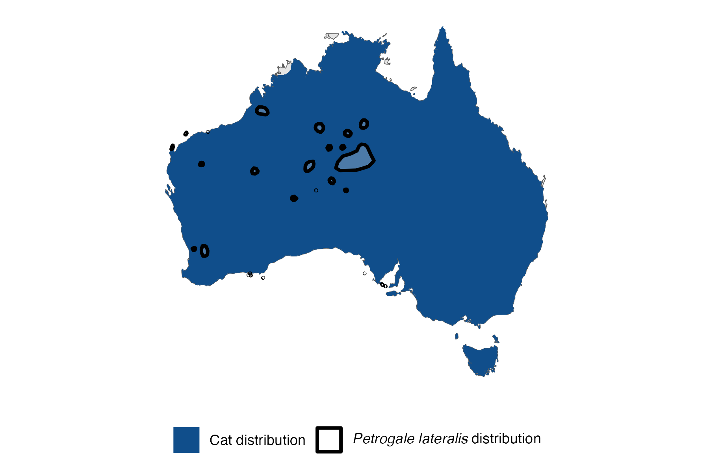

```{css, echo=FALSE}
h1, h2, h3 {
  text-align: center;
}
```

## **Black-footed rock-wallaby**
### *Petrogale lateralis*
### Blamed on cats

:::: {style="display: flex;"}

::: {}
  ```{r icon, echo=FALSE, fig.cap="", out.width = '100%'}
  knitr::include_graphics("assets/phylopics/PLACEHOLDER_ready.png")
  ```
:::

::: {}

:::

::: {}
  ```{r map, echo=FALSE, fig.cap="", out.width = '100%'}
  
  ```
:::

::::
<center>
IUCN Status: **Vulnerable**

EPBC Threat Rating: **High**

IUCN Claim: *"The main threat overall to this species on the mainland is predation from introduced Red Foxes, and foxes are known to have played a major role in the decline of the species historically. Predation by feral cats is also occurring.'"*

</center>

### Studies in support

Cats hunt rock-wallabies (Paltridge et al. 1997; Read et al. 2018).

### Studies not in support

Cat prey preference for rock wallabies was relatively low (Read et al. 2018).

### Is the threat claim evidence-based?

There are no studies linking cats to black-footed rock-wallaby populations.
<br>
<br>

![**Evidence linking *Petrogale lateralis* to cats.** Systematic review of evidence for an association between *Petrogale lateralis* and cats. Positive studies are in support of the hypothesis that *cats* contribute to the decline of Petrogale lateralis, negative studies are not in support. Predation studies include studies documenting hunting or scavenging; baiting studies are associations between poison baiting and threatened mammal abundance where information on predator abundance is not provided; population studies are associations between threatened mammal and predator abundance.](assets/figures/Main_Evidence_Cat_Petrogale lateralis.png)

### References

Paltridge, R., Gibson, D., & Edwards, G. (1997). Diet of the Feral Cat (Felis catus) in Central Australia. Wildlife Research, 24(1), 67. doi:10.1071/wr96023 

Read, J. L., E. Dagg, and K. E. Moseby. "Prey selectivity by feral cats at central Australian rock-wallaby colonies." Australian Mammalogy 41.1 (2018): 132-141.

Wallach et al. 2023 In Submission

